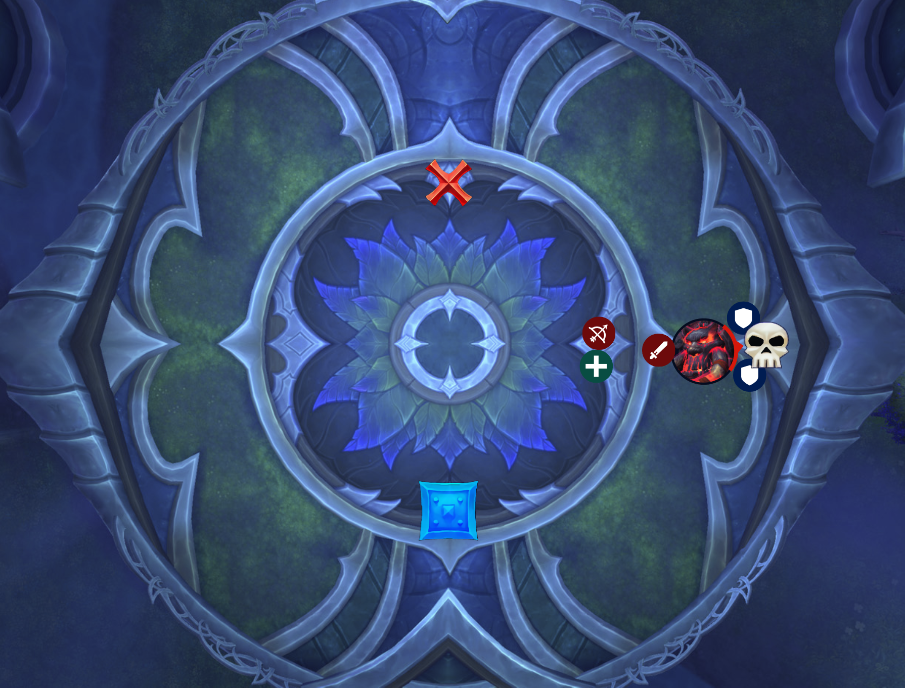
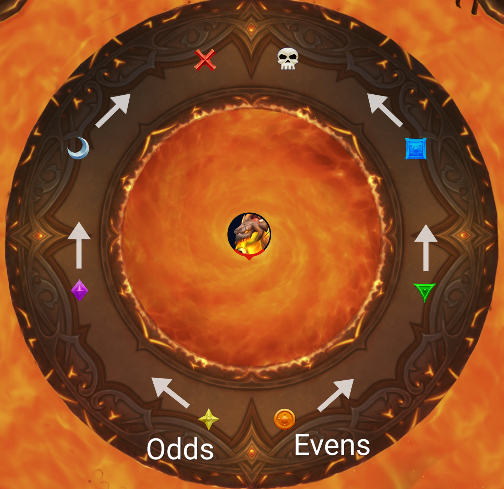
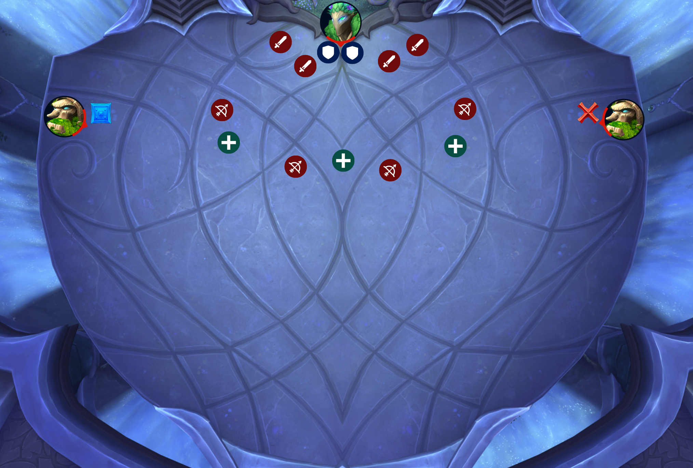
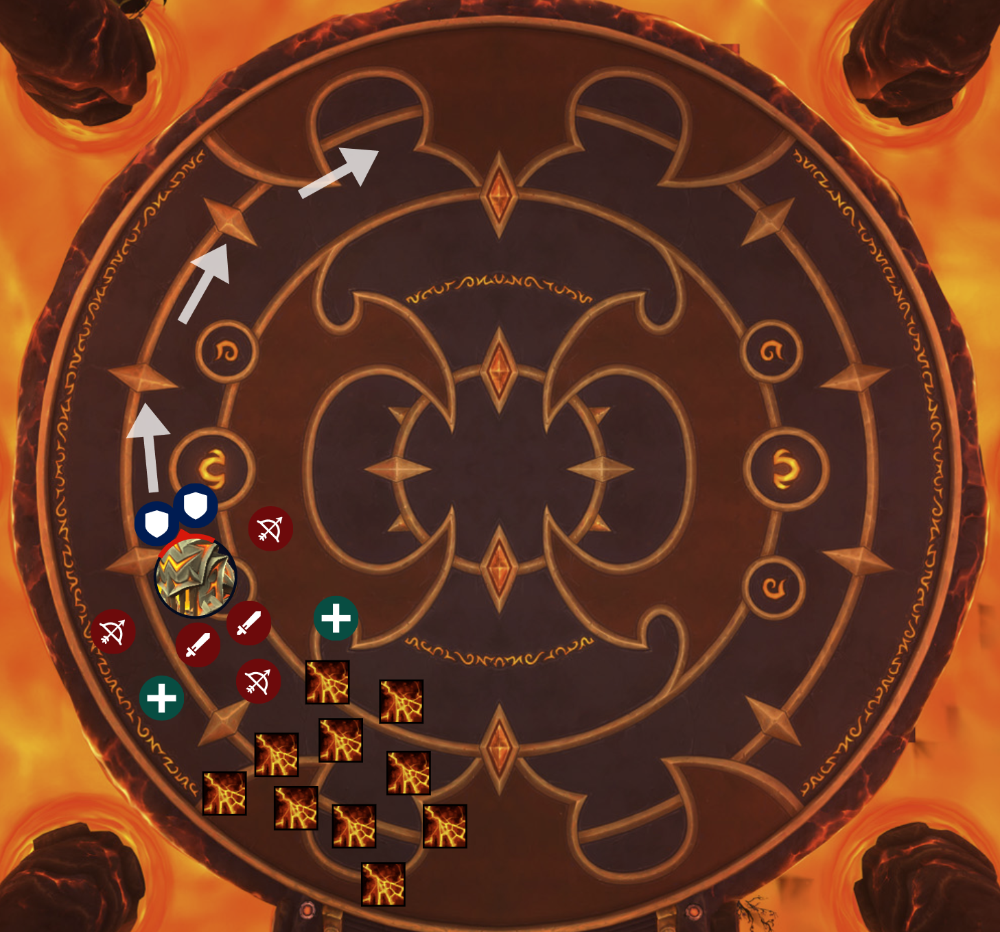
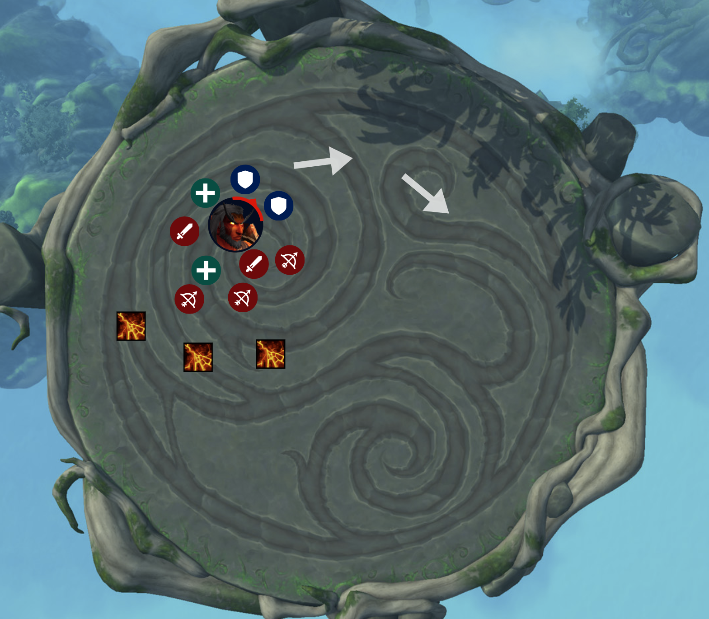

<link rel="stylesheet" href="../../assets/style.css" />
<link rel="icon" href="data:image/svg+xml,<svg xmlns=%22http://www.w3.org/2000/svg%22 viewBox=%220 0 100 100%22><text y=%22.9em%22 font-size=%2290%22>♟</text></svg>">

<section class="table-of-contents">

- [Gnarlroot](#gnarlroot)
- [Igira the Cruel](#igira-the-cruel)
- [Volcoross](#volcoross)
- [Larodar, Keeper of the Flame](#larodar-keeper-of-the-flame)
- [Council of Dreams](#council-of-dreams)
- [Nymue, Weaver of the Cycle](#nymue-weaver-of-the-cycle)
- [Smolderon](#smolderon)
- [Tindral Sageswift, Seer of the Flame](#tindral-sageswift-seer-of-the-flame)
- [Fyrakk the Blazing](#fyrakk-the-blazing)

</section>

# Amirdrassil Strategy

## Gnarlroot

### ✅ Preparation

- Get **odds/evens** groups ready
- Odds **blue marker**, evens **red marker**
- **Skull** marker at the edge of the room
- If possible, setup a **warlock portal** that goes through the centre of the room

### 📜 Overview

- **Some AoE**, I recommend talenting a bit of **AoE**
- This fight has **two phases**; those phases are on a **timer** and they **loop**
- In **phase 1** we fight the boss at the edge of the room and occasionally deal with **adds**
- When he gets to **100 energy** he'll move into the **centre** of the room for a **down phase** or intermission where he takes no damage

### 🛡 Tanks

- Start with the boss on **skull**
- Basic **tankbuster** called **Barrage**
  - He'll channel on you and you'll be hit **five times**
  - Half of it is **physical** and half of it is **spell damage**
  - Each hit is a **stacking debuff**
  - I think just take the whole thing and swap when it's done
- The raid is going to be **dropping big pools** and we might need to **move**; up to you
- Always grab all **adds** that are up - don't let them attack the raid - and tank the adds on the **boss** for cleave
- The boss will occasionally face the raid with a **frontal breath** but that's on us to dodge it; you're not doing anything wrong

### 🤺 Raid

- **Big red circle** on you means you're about to drop a **pool**
  - On **normal** I think we can drop these anywhere that is **safe**; avoid the **centre** of the room
- Dodge the **breath** from the boss and kill **adds**
- For **phase 2** the boss will walk to the **centre** of the room for an **intermission**
  - We are going to split up into two teams: **odds** on **blue**, **evens** on **red**
  - There will be **large tree roots** eminating from the boss
  - The **tree roots** are **impassible** meaning you have to walk around them
  - What we need to do is set the **tree roots** on **fire**
  - You do this by standing in **personal soaks**
  - When you stand in a **soak**, you get **5 stacks** of a **debuff** that you can use to set **tree roots** on fire by just **walking into them**
- Once all **tree roots** are dead, the boss is going to be **stunned** and take **100% increased damage** for **20 sec**, so CDs and lust it
- **Avoid** walking through the **centre of the room** where the boss is during the **intermission**, I think it's **lethal**

### ⚕ Healers

- I'll use CDs in phase 1
- Healer 2: have a heal ready for the intermission
- Healer 3: have a heal ready for the lust

### 👌 Summary

- In **phase 1**, **drop pools**, dodge breath and kill adds
- In **phase 2**, split up: odds blue square, evens red X
  - Help soak the **individual soaks** and then touch the **tree roots**; avoid running through the boss
- **Lust** one all **tree roots** are dead

### 💀 Heroic

- Adds are now dormant when they spawn and you have to wake them up with pools
  - Drop your **pool** on **sleeping adds**; the little plants sitting in the ground
  - Dropping your **pools** on **adds** will wake them up and we can kill them
  - Why do we want to wake them up? When adds wake up, **they deal raid damage**
    - When you enter **phase 2**, all dormant **adds** wake up, so if there are too many it could be a **wipe** so we want to wake them up a little bit at a time
- Missing a soak does **raid-wide damage**

## Igira the Cruel

### ✅ Preparation

- Split raid into three groups, excluding tanks: **yellow**, **green**, **purple**
- Place markers: **blue, green, yellow, purple**

### 📜 Overview

- This is **one phase** and **mostly single-target**
- The main gimick in this fight is called **torment**
  - Have a look at the **three weapons** in the arena
  - When the boss reaches **100 energy** she will offer us **three torments** and we get to pick one
  - All it means is that when we pick a **torment**, she gains an **ability** that we have to deal with
  - There will be one torment on **green triangle**, one on **purple diamond** and one on **yellow star**
  - The **torments** are just **big red circles** on the ground that we need to stand in to **soak**
    - The **circle** shrinks when we **soak** and once it's **fully soaked**, she gains the ability
  - So, we fight the boss, she gets to 100 energy, we soak a torment, then we return to normal while we deal with that new ability, then a few minutes later she'll get to 100 energy again and we pick the next torment and deal with that and so on
  - We're going to have **group assignments** for soaking the **torments**, so check your group
    - Can I get **group one** go to **green triangle**, **group two** go to **purple diamond** and **group three** go to **yellow star**
  - **Lust** at the **start** unless we run into trouble at the end of the fight

### 🛡 Tanks

- Tank her where she is is fine
- Her **auto attacks** hit the next closest person just like **Sludgefist** from **Castle Nathria** so you need to **hold hands** otherwise you take **double-hits**
  - This also means be careful not to kill **melee**; yell at them if they get too close
- Her **auto attacks** also apply a **stacking DoT**; my guess would be swap at around **10 - 12** stacks but you'll have to get a feel for it

### 🤺 Raid

- Unless you're dealing with something, our general stack spot is **blue square**
- When you get a **big red circle** on you, the boss is going to throw a **spear** at you
  - It will hurt and you will **tethered** to the spear and you need to **kill it** to break free
  - There is also a **pool of bad** underneath the spear; so melee you can help kill spears but just don't die to the pools
  - Let's **cluster the spears** around the boss and burn them down quickly
- The boss will occasionally face the raid and throw **swords** out, just **dodge them**
  - Do you remember the **Amalgamation boss** in Aberrus? The one with a the **purple void boss** and the **fire boss**?
  - It's just like the fire boss' **tornados**
- Regarding **torments** there are **three possible abilities** that the boss will get
  - When **green team** soaks the torment on **green triangle**, she will gain a **leap ability**
    - It means that occasionally she will **leap** somewhere and we just **dodge it**
- When **purple team** soaks the torment on **purple diamond**, it means we will occasionally get a heal absorb on us
  - It's up to the **healers** to heal through this but maybe throw a **personal heal** on yourself if you can spare it
- When **yellow team** soaks the torment on **yellow diamond**, it means a **split-damage soak** on the **tanks**
  - In order to deal with this group soak, we'll use our groups
  - **Green** team first, then **purple** team second, then **yellow** team third

### ⚕ Healers

- This fight ramps up a lot towards the end
- It hurts when she casts **Harvest of Screams**
- It hurts when she **leaps** which is called **Smashing Viscera**
- When she casts something called **Heart Stopper** a bunch of people will get an **absorb shield** on them and you need to heal through it
  - A **healer CD** might be worth it

### 👌 Summary

- **Spears**: cluster up near the boss if you're targeted for spears
- **Green team** soak the **first torment** on **green triangle**
- **Purple team** soak the **second torment** on **purple diamond**
- **Yellow team** soak the **third torment** on **yellow triangle**
- **Lust** on pull

### 💀 Heroic

- Players now get a **debuff** when helping **soak a torment**; but we already handle this in normal by using **groups**
- The **leap torment** now releases **fire swirlies** everywhere to dodge
- The **absorb shield torment** now releases **orbs** to dodge from the player when the shield is removed
  - _During the beta, people pixel-stacked to deal with this, because the orbs have a grace period_
  - Also the player explodes in a 7yd radius so you have to spread out a bit

## Volcoross

### ✅ Preparation

- Get the raid ready for two groups: **odds**, **evens**
  - Odds left, evens right
- Maybe have each group stand together on star/circle or at least left side/right side

### 📜 Overview

- Classic fight with the stationary boss in the middle
- Single target, single-phase
- For this fight we will be splitting up into two groups: **odds** and **evens** and making our way around the platform
- **Lust** on pull

### 🛡 Tanks

- Boss' melee stacks a **DoT** on you and it's also a **damage taken debuff** for his **tankbuster** which is called **Cataclysm Jaws**
  - So take a bunch of **stacks**, and then right before the **tankbuster** hits, **taunt swap**
- Other than that, try to be in range of the boss so he doesn't AoE the raid and stick with your group

### 🤺 Raid

- We start grouped up together around **yellow star** and **orange circle**
- If you get a circle on you, it's a **DoT** so just **stay away from others**
- Occasionally the boss' **tail** will cast a shadow over us and then **slap down**; so dodge that
- The big mechanic here is that the boss will create **two big soaks**
  - The first round of two big soaks is one on **yellow star** and one on **orange circle**
  - So **odds** soak **left**, **evens** soak **right**
  - The next two soaks are **purple diamond** and **green triangle**
    - Have a look at where those are and you can see why we need to split up
  - The other markers around the room are other soaks

### 👌 Summary

- **Soak** with your team and then **odds head left** (clockwise) and **evens go right** (counter-clockwise)
- Watch out for the **shadow** of the **tail** and dodge it
- Spread out if you have a circle on you
- **Lust** on pull

### 💀 Heroic

- When the tail slaps down, a few fire rissoles emanate out left and right; just dodge them

## Larodar, Keeper of the Flame

### ✅ Preparation

- Nominate a bunch of DPS as **cleaners**
- Take them to a separate **Discord channel**
- For this fight the floor is going to be convered in **fire patches** and so we could run out of room
- In the middle of the room there is a **seed**
- The seed has a **progression bar** above it between **0% to 100%**
- As a cleaner, your job is to click the **seed** which will equip you with a **hose**
- Then you can walk up to **fire patches** to clean them and make them go away
- When you click the seed, you don't have to do anything extra, your character will just start hosing and you're ready to go
- So you click the **seed**, use **speed boosts** and clear as much **floor** as you can
- Once you start hosing, the seed's **progress metre** will go down - i.e. you'll empty the **fuel tank**
- If the **fuel tank** is low, like less than **30%** it's probably not worth using because you'll just run out too quickly
  - So maybe wait until the progress bar is a bit higher - anything over 30% is probably good
- I think we'll probably want **one person cleaning** at a time - though that is not a hard rule - just a **suggestion**
- And once you have **cleaned once**, you shouldn't do it **again**
- It's up to you all to **coordinate cleaning**; let's start with (player X) first and (player Y) second
  - Announce when you're the **next cleaner** and announce when you're **done cleaning** so that another person can volunteer to get next; like what we do for interrupt rotations
- If the seed is **0%** and not filling up, that's not your fault and there is nothing you can do
  - The seed is actually filled up by friendly NPCs and it's up to the healers to keep them alive and even then the friendly NPCs will eventually die
- Cleaning isn't a thing in **phase two**; this task is **phase one only**

### 📜 Overview

- This is a **two phase fight**
- It is mostly **single target** but there are occasional adds so bring some **cleave**
- **Phase one** is **killing adds** and occasionally hiding in a **bush** to avoid **massive AoE damage** while also trying to clean the room of pools of fire
- **Phase two** starts at **40% hp** and is a **burn phase** that ramps up in intensity with a soft enrage
- **Lust** phase two

### 🤺 Everyone

#### Phase 1

- You'll notice that there is a **seed** in the middle of the room and there are **fire patches** everywhere
- The fire patches will grow all over the place in this fight and we're going to try to stay grouped near the boss, close to the middle of the room, not too far from the seed
- The boss is going to spawn a few **tree adds**
  - DPS need to **kill the adds**
  - Once they are dead, those trees become **healable**
  - So then **healers** heal them up and they become **friendly NPCs**
  - Once they are full health, the **tree NPCs** will start to heal the **seed**, which increases its **progress bar**; it will start filling up from 0% up to 100% kind of like a fuel tank
  - Then you can click on the **seed** to clear **fire patches** on the ground
  - We already have a group of DPS assigned as **cleaners** to do this job; but just be aware that that is how it works
  - So we **kill the adds**; then **heal them**; then the **cleaners** will rotate cleaning duty to clear **fire patches**
- Another mechanic is dodging **little fire swirles** on the ground
  - That's easy enough, but when this happens there will be a few **fire orbs** that will float towards the boss
  - Please **don't let them get to the boss**, you must **soak** these by running into them, you get a DoT and a **20% crit buff** when you soak these
- Also in phase one is some **roots** will **slowly chase** one person
  - Everyone **kill the roots** and then, just like the trees, **healers** heal it up
  - Once it's fully healed it'll turn into a **friendly bush**
  - We use this bush for the boss' big scary mechanic which is called **Inferno**
  - Basically the boss will channel this **lethal AoE** on us; **one tick** will kill you
  - But if you're near the **bush**, it's **90% damage reduction**

#### Intermission (40%)

- The **intermission** is short; it's just a **chanelled AoE** between phases one and two
  - It hurts a ton, so just **stack up** and stay alive until it's over
  - Use **self-heals** if you can

#### Phase 2

- A **race** to the end
- There is no more **seed** or **cleaning** so we just have to manage with limited floorspace
- There is no more **bramble** to heal and hide in
- There is an **individual soak** mechanic so please help soak
- The **tree adds** are different; they now spawn **far away** from the boss and there will be **lots** of them and they will **march** slowly towards the boss
  - Kill the **adds** and use snares, stuns, knockbacks whatever works
  - **Melee**, these adds will be pretty hard for you to reach and they **detonate** when killed so **help out** if you can, especially with **ranged attacks** if you have them, and don't be near tree adds once they are **low HP**

### 🛡 Tanks

- The boss constantly drops **fire patches** when moving so you want to avoid moving the boss too much
- In phase one your job is the **boss** and the **adds**
  - The tank mechanic from the boss is a **charge**
  - The damage **you take** is reduced based on **distance** so just **run away** from the boss
  - And the damage that we take is reduced based on **distance** also, so have the boss charge **away from the raid**
  - Keep in mind that the boss will be **dropping pools** when he moves so having him run over **existing pools** is a good thing
  - When you get hit by the charge you'll have a **damage taken debuff** so taunt swap
  - Remind melee to get out of the way so they don't get hit by the **charge**
  - Pick up the **tree adds** in phase one
- In phase two the tank mechanic is a **frontal cone**, not a charge, so **face him away**
  - The debuff from this is **100% mortal strike**
  - But you will have a **circle** on you which you can use to **leech health** from other people
  - So once you've got it do a **taunt swap** and then run around to **top up** and try not to kill people

### ⚕ Healers

- In phase one you need to heal the **tree NPCs** and the **bramble**
- The intermission, which is the transition from phase one to phase two, hurts a ton so big CDs
- In phase two there is an **absorb shield debuff** going out on people called **Flash Fire** that you need to heal through
  - If we don't heal through it within **8 seconds** they detonate

### 👌 Summary

- For phase one
  - **Kill all adds** and then **heal** them up
  - We clean up the floor with our **cleaners**
  - Collect the **red fire orbs** before they get to the boss
  - We stack up in the **green circle** for **Inferno**
- For the **intermission** we get away from the boss and stack up for big heals
- For phase two
  - We **lust** it
  - We do **individual soaks**
  - We **kill adds**

### 💀 Heroic

- The tank **charge mechanic** from the boss in phase one now does **raid-wide falloff damage**
  - No real change here, just have the boss charge away from the raid
- The **roots** that chase people are **untargetable** until you hit it with some **Dream Blossom**
  - The people in charge of the **seed** need to find it and douse it before we can kill it
- People that interact with the **seed** get a 4m debuff preventing them from doing it again
  - We already deal with this by rotating people doing it
- The **adds** in phase two leave behind **pools of fire**
  - No change in strategy, as you can't clear them; just kill the adds and eventually we'll run out of room
- The tankbuster from Urctos, **Agonizing Claws**, is now a frontal cone

## Council of Dreams

### ✅ Preparation

- Get the raid into two groups: **odds and evens**

### 📜 Overview

- Check your groups - odds/evens
- This is a single-phase **cleave fight** - you will usually have **two targets**
- First of all, **poison cleanse** can help in this fight, if you can afford to pick up a poison cleanse - especially shaman with their **totems**
- We have **three bosses** up at all times - they do not share a **health pool** and all three **must die at the same time** or they res each other
- The first mechanic for this fight is **Polymorph** which comes from **Pip** where a bunch of people will be turned into **ducks**
  - When you are a **duck** you will get **two abilities** on your bar
  - The **first ability** is a speed boost - use that freely
  - The **second ability** is **Preen** which removes polymorph
  - You can only cast **Preen** after you walk through some **poison flowers** - there are going to be little circles on the ground with poisonous flowers that you usually want to avoid
  - But when you're a **duck**, you're immune to **poison damage**, so walk through some **poison flowers** and then **Preen** yourself
  - Do be aware that when your **polymorph** is removed will polymorph anyone close to you so please do it **away from others**
  - If there are **no flowers** to eat when you're a **duck**, you'll just have to sit out and wait until the **timer expires**
- Each boss has an **ulti ability** that is dangerous and we need to deal with
  - **The bear's ulti** is a **Blind Rage** which is a chanelled AoE
  - In order to stop this, I will need one duck to volunteer to **Preen** themselves on **Urctos**
  - This is because when you get rid of your polymorph on **Urctos**, it turns him into a **duck** which stops the channel
  - So listen out for when we need a **duck volunteer** to **Preen** on the boss, keeping in mind that you need to eat some **poison flowers** before you can **Preen**
- **Pip's ulti** is called **Song of the Dragon**, it puts a **poison damage absorb shield** on everyone and you need to remove it
  - If you don't remove it in time you get **stunned for 15 seconds**
  - To remove it you need to take **poison damage** and the easiest way to do that is to stand in some **poison flowers**
- **Aerwynn's ulti** is a channel that will **drag** all of us towards her
  - That's bad because it'll drag us into **poison flowers**
  - When you're being **dragged** listen out for your **group** being called - **odds or evens** - to help soak a charge from the **Urctos**
  - Basically **Urctos** is going to run at **Aerwynn** and I need the **soaking group** to deliberately get hit by the charge

### 🛡 Tanks

- You are tanking **Urctos** the bear
- He has a standard physical damage **tankbuster** with a damage taken debuff
  - On heroic the tankbuster is a frontal so maybe just practice for that even on normal
- The other two bosses **cannot be moved** so your job is to take **Urctos** to either **Pip or Aerwynn**
  - It's up to you to which ranged boss to take the bear to, just keep health pools the same for all bosses
- Another job of yours is dealing with Urctos' **Barreling Charge**
  - When he does this you'll see a **red arrow** on the ground where he is aiming at and you need to aim and hit **Aerwynn**
  - The tank that is aiming it **should** get hit by the **charge** which helps **soak** it and the other tank should **not soak it**
- **Urctos'** ulti is **Blinding Rage** where he'll stand still and slap the ground for 20sec
  - We need to **interrupt** this and we do that by having one of our **ducks** dispel themselves on top of **Urctos**
  - So when **Blinding Rage** is coming up, i.e. near 100 energy, ask for a duck to come over and **Preen** themselves on **Urctos**
  - You need to dodge the duck because if you're within **7yd** of a duck dispelling themselves, you will be polymorphed into a duck
- I think Pip's ulti - **Song of the Dragon** - includes you and so you will both need to stand in **poison flowers** to get rid of the absorb shield (20sec timer)

### 🤺 Raid

- Generally for this fight we are going to be **spread out**
- Please prioritise **Pip or Aerwynn** and just cleave on the bear
- If you get targeted with a **green circle** on you, it's called **Javelin**, just move away from others and then use **poison cleanses**
- **Lust** on pull

### 👌 Summary

- Remember your groups - **odds or evens** - and help soak the **charge** from the **Urctos** - don't soak if it's not your turn
- Try to prioritise damage on **Aerwynn** and **Pip** and just cleave **Urctos**
- When you turn into a **duck**, walk over some **poison flowers**, then use the **Preen** ability to remove the polymorph
  - Also when you are a **duck** listen out incase I need someone to **Preen** on **Urctos**
- When **Pip** does his ultimate, **Song of the Dragon**, stand in some **poison flowers** to remove your absorb shield

### 💀 Heroic

- When **duck polymorph** ends, you polymorph anyone within 7yd
  - _(On normal it just disorients you for a few sec)_
- **Barreling Charge** now leaves behind a 30s **500% damage taken debuff**, meaning you can't soak it again
  - We already deal with this using **groups**

## Nymue, Weaver of the Cycle

### ✅ Preparation

- Pronounce "NIM-weh"? "NEEM-you"?
- Two markers: **blue square** on the left and **red X** on the right
- Get two groups ready: **odds and evens**
  - Have one healer in each group, if there is a third healer (or more) have them be around the centre during phase one
  - Odds **blue square**, evens **red X**
  - For phase one, each group should roughly stick to their side; i.e. imagine a wall splitting the room in half

### 📜 Overview

- This fight has **two phases**, and it cycles between phase one and phase two on a timer
- Purely **single-target**
- In **phase one** we deal with the **boss** and in **phase two** we split up into **teams** and fight a **miniboss** each; one on **blue square** and one on **red X**
  - Odds blue square, evens red X
- The way this fight works is that the room is divided by glowing lines called **verdant lines**
  - If you pass through a line, you will take a short **2-second DoT**; but this DoT stacks if you run through additional lines within that **2 seconds**
  - **Passing through a line is ok** if you are healthy but try to stagger it before you pass through another

### 🛡 Tanks

- The boss is stationary
- In **phase one** your only mechanic is that occasionally one of you will get a **circle** on you and you just run it out until it expires and then come back
  - So swap on that
  - On normal difficulty, that's about it
  - Other than that, her only threat to you is called **Threaded Blast**, it's a big nuke that should hurt but it doesn't have a debuff or anything
- In **phase two**, you will take your team to your marker and tank a miniboss
  - The **miniboss** has no real tank mechanic
  - You can move the **miniboss** but do not take it through a line
- Going back to phase one, you'll notice that when the **circle** on you expires you leave behind a **trail of grass**
  - The **grass** allows us (the raid) to walk through it and walk through the lines without any penalty
- This becomes important for the **phase transition**
  - As **phase one ends**, the boss will cast **Full Bloom**; it'll look like a **dangerous circle** around the boss that you would normally avoid
  - But you want to **get hit** by this
  - Once you do, you have **four seconds** to get to your marker and as you're running, you'll leave behind **grass** allowing your team to follow you safely
  - Remember that the ranged are behind you, further away; so maybe run in an arc that kinda "scoops up" your ranged people so that they can touch **grass**

### 🤺 Raid

- In phase one
  - For positioning
    - Everyone should imagine a **wall** going down the middle of the room from the boss; **blue team** should be a little **left of centre**, **red team** should be a little **right of centre**
    - Melee will be up near the boss but ranged need to spread out a bit
  - The reason that we spread out is that ranged, you need to **soak green plants**
  - There will be little **green circles** with plants in them going out all the time and they **pulse AoE** on the raid
  - If you stand in them, it reduces their duration from **minutes** to **seconds**
  - **Crossing a line** to soak a plant is better than that plant's AoE
  - The only other thing in phase one is **horizontal laser beams** that march slowly outwards from the boss; just **dodge them**
    - **Melee** you can see where the **laser beam** is coming from if you watch carefully so you get an early warning
- As we **transition** to phase two you need to **follow your tank** to your marker
  - Your tank will leave behind a **trail of grass**, you should walk in this grass to follow them
  - Once you're at the **miniboss**, just dodge anything dangerous
- Once we return to phase one the boss will **redraw the lines** so the pattern will be completely different

### ⚕ Healers

- During phase two, when you're fighting the miniboss, you might need a healer CD per team when the add is under 30%

### 👌 Summary

- In phase one
  - Running through a line is ok but don't do it too often
  - Ranged soak the green plants
  - Everyone dodge laser beams
- When we transition to phase two, follow the tank for your team by walking in the grass that they leave behind

### 💀 Heroic

- The **explosive seed mechanic**, Weaver's Burden, now applies to several players rather than just the tanks
  - **Ranged** should drop pools at the back
  - **Melee** should drop pools to the left or right of the boss along the wall
  - Now leaves behind a **Monk donut**
  - The player gets a **+100% nature damage taken debuff** (30s) which forces tanks to swap? Since her main nuke is partially nature damage
- The **tree adds** now also spawn the plants that need to be **soaked**

## Smolderon

### ✅ Preparation

### 📜 Overview

- This is a purely **single-target fight** with one main phase and one intermission or down phase similar to **Rashok from Aberrus**
- It **repeats** in a loop between phase one and the intermission
- If you get a **fourth intermission** it's a hard enrage
- **Mechanically** this fight is quite simple, it's just a lot of movement
- For this fight, **pools of lava** will occasionally spawn under us and they are permanent so we will run out of room
  - It's important to bait these pools close in a **cluster** rather than spread them out
- So what we're going to do is fight near the **edge** and walk the boss slowly around the room

### 🛡 Tanks

- Walk the boss around the room clockwise, staying ahead of the **lava pools** on the ground
  - Running out of room is a **soft enrage**
- Your tank mechanic is a **soak** where half of the raid needs to save you
  - Soaking leaves a **debuff** so only the current tank should take the hit
  - Maybe the **offtank** should go stand behind the boss with the **melee**
- **Taunt** after each soak mechanic

### 🤺 Raid

- Don't go infront of the boss because we're going to be **dropping pools** and we want to be dropping them **behind us**, not where we're about to walk to
- For phase one
  - Half the raid is going to get a debuff called **Overheated**; it's a circle around you
    - Just **spread out** for it
  - The other half of the raid needs to help **soak** on the tank for a **split damage mechanic**
  - Be aware that when you help **soak** you get a **heal absorb** on you and when we heal through that, an **explosion** will drop at your feet so dodge it
- For the **intermission** the boss will go to the **centre of the room** and do a **knockback**
  - Come in a bit and don't be near the edge
- At the start of the **intermission**, some people will drop **firey orbs** that will slowly float towards the boss
  - Only you can see your own **orbs** and you must **pick them up**; there's about five of them
  - They give you a **damage and healing buff**
  - If they reach the **boss**, he gets a **buff**
- During the intermission we will be **dodging donuts**
  - If you remember in **Halls of Infusion** dungeon the third boss is a female troll called **Khajin the Unyielding**
    - She casts **rings** - it's that

### 👌 Summary

- Phase one
  - Stay **clustered** behind the boss
  - Spread if you get **orange circle** on you, otherwise **soak** on the tank
- For the intermission
  - There is a **knockback**
  - Then collect your **orbs** if you have some
  - Dodge the **rings**

### 💀 Heroic

- The tank that gets hit by the **soak**, aka **Brand**, now gets a **6sec bomb** with **falloff damage**
  - Tank must run away from the raid
- **Overheated** now releases fire tornadoes to **dodge** when it expires
  - They are in an inverted Y pattern - one out your front, one back left, one back right

## Tindral Sageswift, Seer of the Flame

### ✅ Preparation

- First thing: if you have talents that break **roots** please grab them
  - Things like Blink, Pally Freedom, Druid Shapeshift, Monk Tiger's Lust etc are great here

### 📜 Overview

- Mostly **single target** but some **bursty AoE is good**, please bring some AoE
- Three phases
  - Each phase is fought on a **different platform** so this **first platform** is **phase one** and then we go to **other platforms** for phases two and three
  - In **phase one** we deal with his caster form abilities and his **Moonkin form** which has a couple of extra abilities
  - In **phase two** we deal with his caster form abilities again but this time his **Tree form** which has different abilities to Moonkin
  - And then in **phase three** its caster form abilities, and **Moonkin** and **Tree**
  - So **phase three** is a burn phase on the **final platform** where we will lust

### 🤺 Raid

- For positioning, everyone try to be **fairly close** to the boss
- Throughout the fight we have to deal with **Entangling Roots**
  - You know this is coming because everyone gets **little circles**
  - For this we want to **cluster up** around the boss; just **don't overlap your circles** on each other
  - A **root** will spawn on each of us and you need to **kill them**; please help break out the **healers**
  - If you have a **root escape or immunity**, you can use that
- Next up, the boss will put a **DoT** on a few people called **Fiery Growth**
  - If you get this, get away and go behind the raid and ask for a **dispel**, when we dispel you, you will drop a **big pool**
- If you get a **big blue circle** around you, just move away from the raid anywhere
  - You'll **detonate** after a few seconds and then everyone will have to **dodge blue swirlies**
- Once **phase one** is done the boss will change to **Owl form** and cast a **knockback** and he will flee to the next platform
  - What you need to do, everyone, is pick up a **feather** which will grant you your **dragon mount**; so you will be **dragonriding** for this
  - Your job is to follow the boss and along the way pick up **green orbs** and dodge **red orbs**
  - **Green orbs** give the whole raid a **damage boost**
- Now, when the boss gets to the next platform he will **shield himself** and start casting a **30 second hard enrage**
  - **All DPS**: you must get to that platform quickly and get through his shield to **interrupt him**
  - **Healers and tanks** you can spend an extra few seconds if you need to pick up **green orbs**
- In **phase two** the boss will sometimes put **fiery seeds** all over the ground
  - Your job is to walk over **two or three** of them
  - They do hurt with a **stacking DoT and debuff**, so be careful
  - But feel free to **Hunter turtle** or **Rogue cloak** and pick up a bunch

### 🛡 Tanks

- Tank the boss not at the **edge** of the room and not in the **centre** of the room
  - The raid will be **dropping pools** so just move us as needed
- **Two main mechanics** for you
  - Your tank mechanic is a **DoT** that the boss applies through **autoattacks** so **taunt swap** as needed
  - The other thing the boss does is summon **four big mushrooms** nearby
  - Each one spawns three seconds apart and each mushroom detonates after three seconds
  - Your job is to **soak them** and you don't want to soak **two in a row**; so just alternate soaking them
  - You don't need to **taunt swap** for this
  - Obviously one of you will be moving the boss in order to **soak** but that's fine he has **no cleave**
  - Probably your biggest challenge in this fight is needing to **soak a mushroom** but you're **rooted in place**
    - If you can **break roots** or have **root immunity**, that's the time to do it
- In **phase two** we'll have a mechanic where fire seeds are all over the ground and the raid needs to stomp on them
  - **If you can help** with this that's great
  - Running over lots of them **hurts** but as a **tank** you're probably fine
  - This **mechanic** isn't your highest **priority**

### ⚕ Healers

- In phases two and three there will be **healing absorb shields** going out on people
  - No trick to this just heal through it
- Watch out for your **dispel trigger finger**
  - We have a **dispel mechanic** so please listen out and watch for people moving away who need a **dispel**
  - I won't be calling for **dispels**; we just all have to do our part

### 👌 Summary

- Generally try to be clustered up around the boss and cluster up for **Entangling Roots**; break out of **roots** quickly
- Melee, dodge the **large mushrooms** that spawn, they are for the tanks
- If anyone gets the **dispellable DoT**, move away behind the raid and ask for a **dispel** and you will drop a pool
- When **firey seeds** pop up everywhere, help run over two or three of them
- When we're changing platforms, pick up a **feathter**, follow the boss, and get through his **shield**

### 💀 Heroic

- Phase one/three: there are more fire beams during moonkin form
- Phase two/three: Stepping on the seeds gives you a damage taken debuff
  - You don't want too many

## Fyrakk the Blazing

### ✅ Preparation

- Prep

### Phase 1

### 👌 Summary

- Phase one
  - Drop your pools at the back near the other fire pools
  - Run away when he's sucking you in and group up for big heals
- Intermission
  - Spread out and surround the boss
  - Collect orbs, use your DPS CDs and bust through the shield
- Phase two
  - Dodge the deep breath and then kill the adds that spawn; use interrupts and stuns
  - Try to prioritise killing the adds that are in the path of the friendly NPCs
- Phase three
  - Anyone can pick up a seed but be aware that if you take any avoidable damage then you lose the seed and it hurts the raid
  - Apocalypse Roar is the boss' lethal AoE; stack up for it and use your seed; that is, use your extra action button

### 💀 Heroic

- During all phases, random players will gain the Blaze debuff
  - It's a **lines mechanic**
  - Best strategy is to minimise movement and let other people dodge
  - Don't hit friendly NPCs with it