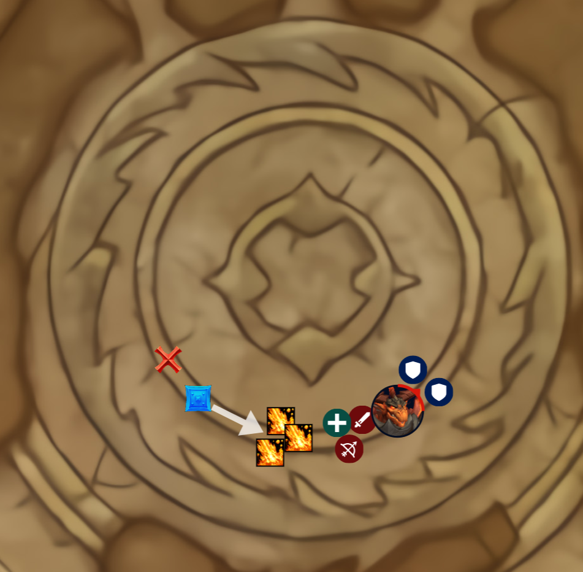
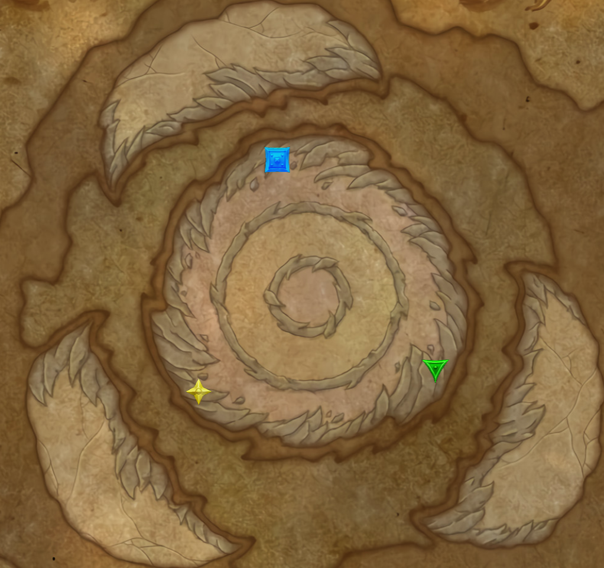
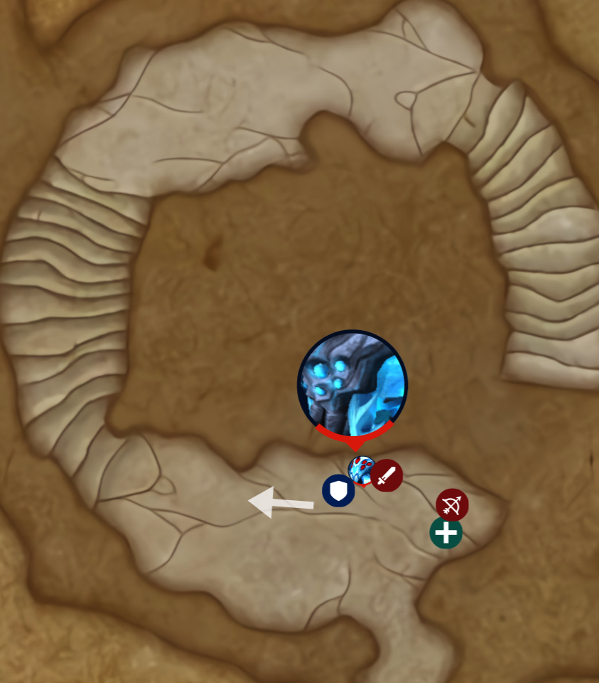
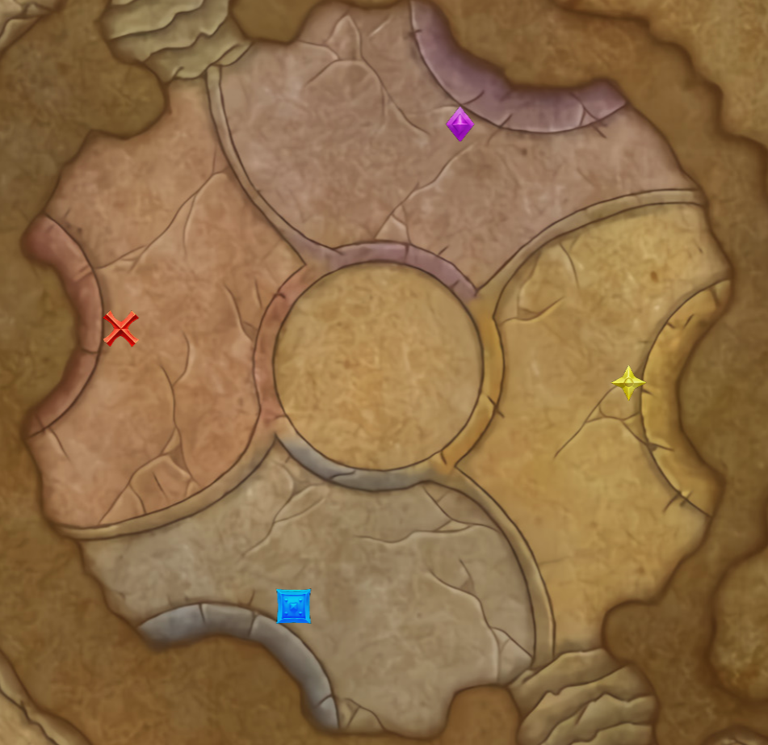
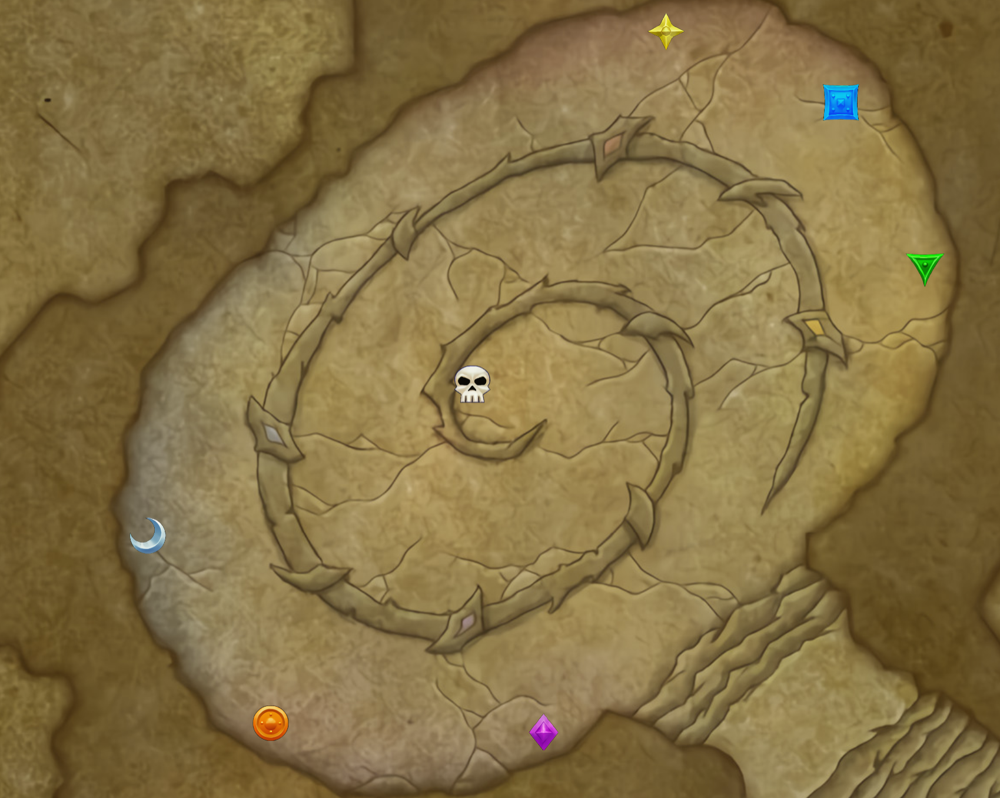
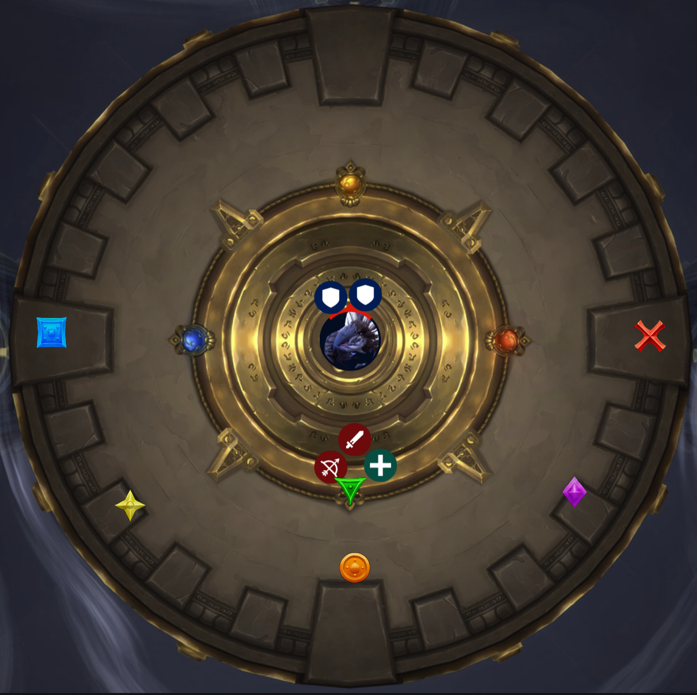
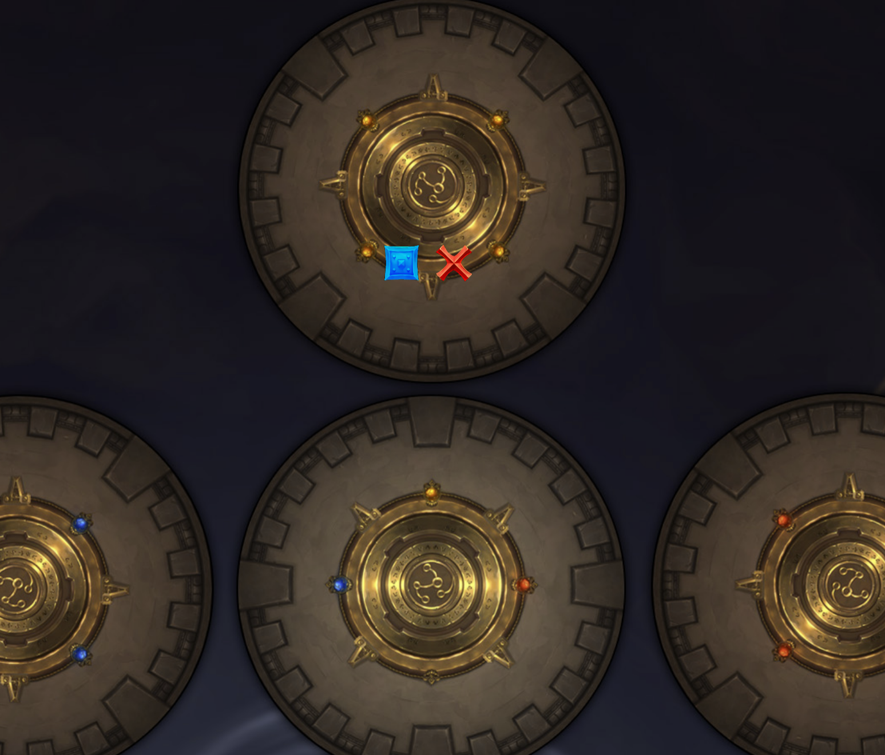

<link rel="stylesheet" href="../../assets/style.css" />
<link rel="icon" href="data:image/svg+xml,<svg xmlns=%22http://www.w3.org/2000/svg%22 viewBox=%220 0 100 100%22><text y=%22.9em%22 font-size=%2290%22>♟</text></svg>">

<section class="table-of-contents">

- [Eranog](#eranog)
- [The Primal Council](#the-primal-council)
- [Dathea, Ascended](#dathea-ascended)
- [Sennarth, the Cold Breath](#sennarth-the-cold-breath)
- [Terros](#terros)
- [Kurog Grimtotem](#kurog-grimtotem)
- [Broodkeeper Diurna](#broodkeeper-diurna)
- [Raszageth the Storm-Eater](#raszageth-the-storm-eater)

</section>

# Vault of the Incarnates Strategy

## Eranog

### ✅ Preparation

- Place down a **blue marker** somewhere on the ring that circles around the room
- Place a **red X** just behind the **blue marker**, about 20yd
- The tanks should grab the boss and **kite** the boss around the room, starting on **blue**
- I will need to mark one of the **Collapsing Flames** with a **skull marker** to indicate the kill target
  - We want to **return** to approximately **where we were**
  - From the center of the room, pick the **left-most target** that **doesn't have a shield**

### 📜 Overview

- AKA "Eggnog"
- This is a repeating **two phase** encounter; we alternate between phase 1 and phase 2 on a timer
- This is a mostly **single-target** fight with some **AoE burst**
- In **phase 1** we'll be **grouping up** and walking around the room with the boss
- In **phase 2** we ignore the boss and get encircled by adds and we need to **kill one** to open up a gap
- **Lust** at the start
  - _(We might need to lust at the end on Heroic, because his roar is ramping damage?)_

### 🛡 Tanks

- Bring the boss to the **blue marker** and walk him around the room along the ring
  - The raid will be behind the boss **dropping pools**, so just stay ahead of us
- Your tank mechanic is a **stacking DoT**: **Burning Wound**; switch when you feel it hurts
- The boss occasionally **cleaves** and I think he targets the raid; so if you see the boss face away you haven't done anything wrong
- There will be **imp adds** fixating on the raid; you can ignore those; if you're not tanking you can help damage
- In **phase two** ignore the boss; you can mostly chill, just help the raid

### 🤺 Raid

- **Group up** behind the boss
- If you get an **orange circle** around you, you're about to **drop a pool**
  - Walk backwards and **drop your pool** behind the raid, starting on the **red X marker**
  - Try to **cluster the pools** closely without hurting each other
- Dropping pools also spawn **imps that fixate randomly**; just burn them down quickly
  - Use **snares and stuns**
- For **phase two**, we're going to be **surrounded by adds**
  - The adds **slowly march** towards the center of the room
  - Burn down the one with the **skull marker** to create a gap
- The boss puts **big spikes** under people
  - They hurt when spawned; dodge them
  - These explode when the boss casts **Incinerating Roar**; dodge red swirlies

### ⚕ Healers

- Zib go first for big heal; use it on Roar; I'll go second
- Nattz big heal for phase 2

### 👌 Summary

- **Group up** behind the boss
- **Drop pools** behind the raid
- **AoE** the adds
- Then in phase 2 we get surrounded by adds; **kill one** to create a gap

### 💀 Heroic

- Nothing

## The Primal Council

### ✅ Preparation

- Mark a ranged with **blue marker** (or any)
  - They aren't the ranged stack as such, but ranged should generally try to be close to them

### 📜 Overview

- This is a **single-phase** AoE fight
- We will be taking on **all four bosses** at the same time and they need to all die at the same time
- **Lust** at the start

### 🛡 Tanks

- Pick up **all four bosses**
  - Two of them are **melee** and two of them are **casters**; the casters are probably difficult to move
- Your tank mechanics come from the melee bosses **Firepath** and **Opalfang**
  - **Firepath** cleaves, so face her away and don't both of you get hit by it
  - **Opalfang** applies a **physical damage taken debuff**
  - You'll need to swap these two bosses
- For **positioning**, we're going to be littering the floor with **pools** and **pillars**
  - Avoid the center and take us around the room as needed
- However, try to be not too far from the **pools of fire** and the pillars; the raid needs them close
- Help interrupt the caster bosses **Icewrath** and **Stormlash**
- Can you watch the health of the bosses and tell the raid to DPS if one is falling behind

### 🤺 Raid

- For **positioning**, generally try to be towards the edge rather than the center of the room
- **Melee** prioritise **Icewrath** or **Stormlash**; AoE all of them of course, but target either **Icewrath** or **Stormlash** and keep the interrupts going
- **Ranged** prioritise the other two; **Firepath** or **Opalfang**; AoE as well but for any single target, go with **Firepath** or **Opalfang**
  - Also try to throw out interrupts on the casters **Icewrath** and **Stormlash**
- Also **ranged** try to be **fairly close together**; this fight will generally encourage us to spread out so it's not a fight where we're stacking up, but also don't be too far away
  - And **ranged**, try to not be in the **middle of the room**
- **Big red swirly** will go out on two people, it is **split damage** and it drops a pool, so place your pools not in the middle of the room and everyone else help soak them
  - A side note for the **big red swirly** is that I think it **destroys pillars**
  - We want some pillars to remain standing but if there are too many in our way, we can clear them
- A **blue circle** around you is a **lightning debuff**; it hurts
  - It's also **contagious**; so if you walk near anyone else, they will catch it too and that's bad; so avoid **transmitting** the debuff to others
  - Stay clear of people with the **blue circle**
  - You can cleanse yourself of this **blue circle lightning debuff** by touching a pillar; the pillars show up during the fight (they are spiky rocks sticking out of the ground)

### 🚶‍♂️ Everyone

- One more thing to talk about is **Blizzard**
  - When this goes off, you'll gain stacks of a **slowing debuff**, at **10 stacks** you'll get frozen in ice and we have to break you out to save you
  - Therefore, to avoid this, everyone needs to **cleanse** themselves by stepping into a **pool of fire**
  - So when I call **Blizzard**, step briefly into a **pool of fire**
  - For each person that steps into the pool, it **shrinks**; so just be aware that you might have to switch to another pool one dries up on you

### ⚕ Healers

- Let's try CDs on the **big red swirly soak**
  - Zib first, then Nattz

### 👌 Summary

- Melee prioritise Icewrath and Stormlash and ranged prioritise Firepath and Opalfang
- Big red swirlies means drop pools somewhere good and help soak them because split damage
- Blue circle means spread out and avoid others, and cleanse yourself by going to a pillar
- Blizzard means touch a pool of fire

### 💀 Heroic

- **Conductive Mark** from **Stormlash** lasts 20 sec, up from 10
- The **pillars** created by **Opalfang** now pulse AoE damage
  - We'll probably want to remove some of these using the **Meteor Axe** mechanic, but maybe not all of them? We need some to remove **Conductive Mark**
- The **axes** from **Firepath** debuff you, increasing damage taken from axes
  - I don't think this changes much, because the ability only comes along every ~22 seconds
  - I think this is just to punish anyone that wanted to soak both

## Dathea, Ascended

### ✅ Preparation

### 📜 Overview

- This is **Dathea Stormlash** who we just defeated in the council fight
- We are now above the room of the first boss if you look over the edge
- Note the **three platforms** around the room
- This fight is **single-phase** and mostly **single target**
- In this fight we're going to be taking on the **boss** on this main platform while dodging **swirlies** and **cyclones** and then occasionally jumping up to one of the platforms to deal with an **add**
- This fight involves a lot of **knockbacks** and being knocked into **other people or mechanics** is what will get you
- **Lust** at the start

### 🚶‍♂️ Everyone

- The boss will do a **suck**; it will suck us all towards her; just **run away** and use **speed boosts**
- There are going to be small **tornadoes** wandering around slowly on the platform
  - They are pretty easy to avoid, but the boss will occasionally cast **Crosswinds**, which will fling the tornadoes **across the room** in a random direction
  - Each **tornado** will indicate its direction with a **blue arrow** on the ground, and a **blue swirly** further away on the ground indicates its destination
  - So therefore, for **Crosswinds**, have a look at the tornadoes in the room and don't be in their path
- The boss is going to summon **two adds**
  - One add will be on **this platform**, and the other add will be on one of the **three platforms**: blue, yellow or green
  - When the add dies, it explodes, **knocking everyone** a huge distance
  - Therefore we need to place the **add** near the **upper platform** and use its death to propel us over
  - Then kill the **add** up there, which will knock us back

### 🛡 Tanks

- Tank the **boss** in the centre of the room
- Your **tank mechanic** hits hard and is a **knockback** and a **damage taken debuff**
- One of you will need to be on **add duty** when they spawn
  - The adds spawning is probably a good time to **taunt swap**
  - When they spawn, one of you grab the one that's on this **platform** and take it to the correct **coloured marker**; call out which marker
  - You need to position yourself so that the **knockback** sends you up to the next platform and tank that add
  - That add will also **explode**, so position yourself to come back

### 🤺 Raid

- **Ranged** spread out around the boss
- The same **lightning debuff** mechanic exists from the previous fight
  - So if you get a **blue circle**, stay away from others or you'll infect them
- When the **add** spawns, you need to position yourself so that the knockback sends you over to the next platform
  - Do not attempt to come up to the platform if you have the **blue circle debuff**
  - If you have the **blue circle debuff**, you can remain on this platform

### ⚕ Healers

- We'll need healers on both platforms and I want each of us to have a turn going up
  - Zib goes up first, unless you have blue circle
  - Nattz goes up second, unless you have blue circle
  - Let's try healer CDs on Cyclone which is the boss' suck ability

### 👌 Summary

- Dodge the tornadoes when they dash across the platform
- Position yourself to be knocked on to a platform and then be knocked back down
- Blue circle means avoid others and stay on this platform

### 💀 Heroic

- One of the **big adds** is now on one of the platforms; need to jump to it
- **Conductive Mark** lasts 15 sec, up from 10
- A bunch of **smaller adds** also spawn on the upper platform
  - They need to be **interrupted** and **AoE'd** down
  - Try interrupts and stuns?
- When adds spawn, it leaves behind a thunderstorm which hurts if you stand under it
  - Either get adds out of it, or it's a job for ranged only?

## Sennarth, the Cold Breath

### ✅ Preparation

- Place a yellow marker slightly on the right for ranged and healers to start

### 📜 Overview

- This is a **two-phase** encounter with a boss and constant adds
- The way this encounter goes is that the **boss** fights from where she is and we make our way up the **stairs** taking on **adds** along the way
- At the **top** she'll go into **phase 2** where she jumps down on to the platform with us and it's a race to the end as a soft enrage approaches
- Lust in phase 2

### 🚶‍♂️ Everyone

- Throughout the fight there are **ice patches** on the ground
  - The **ice patches** cause you to slide around, making it easy to fall off the ledge or run into bad things
- Her **signature ability** is either a **pull** or a **push** mechanic that risks launching you off the ledge
- In order to combat the push, the pull and the sliding, there is also going to be **spider web** on the ground
  - The spider webs are a **snare**
  - Generally you want to avoid **spider webs**, as 10 stacks of it is bad, however getting **one stack** of it helps with sliding and prevents the **push** or **pull** sending you over the edge
  - Therefore, **step into some web** when the big pull or big push is coming

### 🛡 Tanks

- Your tank mechanic from the boss is a **damage taken debuff**, so you'll need to swap
- You need to pick up the **big spider add**
  - It does a **cone AoE** so face it away
  - Tank the **big spider** near the melee but **behind their walking path**
  - What I mean is that the **big spider** also drops ice and we want to **avoid ice** where the melee are about to walk
- There are going to be lots of **small spiders**
  - Try to tank them if you can
  - If you spot anyone **stunned in webbing**, take the small spiders to them
  - The spiders **explode on death** which cleanses the webbing

### 🤺 Raid

- **Melee**, the **boss' hitbox** is pretty big, try to find the limit and stand back from the ledge
- If you get targeted with a **blue circle**, you are about to **explode** so don't be near others
- If you're **dropping web**, try to drop it **in front of the melee** at the **ledge**
- The boss is going to **pull** you in like **deathgrip**
  - **Run back** towards the other ledge and step in **web** to help stay alive
- There are going to be lots of **small spiders** constantly
  - **DoT** them and **AoE** them, although they aren't really your priority
    - Do note that when the **small spiders** die, they explode, which hurts and also dispels the web debuff on you and the web on the ground
    - This means that if the boss is about to **pull** us in, and you stand on some **spider web** to snare yourself, you might think you're safe and then a small spider explodes on you and dispels you, and you get gripped off the ledge
    - It also means that if you have **stacks of web** that you don't want, because of the snare, you can cleanse yourself by standing near a small spider and killing it
- If you are targeted for **Enveloping Webs**, you're going to start **dropping pools** of **spider webs**
  - Try to drop **spider webs** in front of the melee **near their ledge**

### ⚕ Healers

- Let's try CDs for her signature ability which is the push/pull; they're called **Gossamer Burst** and **Repelling Burst**
  - Zib first, then Nattz

### 👌 Summary

- Ice is slippery
- Stepping into spider webs a little bit can help with slipping and the pull and the push
- Small spiders explode
- Blue circle around you means spread out
- Drop web in front of the melee near their ledge

### Phase 2

- In **phase 2**, we're going to fight the **boss** on the **platform** at the top of the stairs
- We can't go back down stairs, and the whole platform is **slippery**
- Her **signature ability** is now a **push**, not a **pull**
  - You need to position yourself so you don't get knocked off a ledge, and remember that standing in **web** will save you
- Your biggest enemy in phase 2 is slippery ice and knockbacks
- We still have the **blue circle debuff** to deal with, but now it also leaves behind a **blue bomb**
  - If you run into a **blue bomb**, it hurts and it's a knockback, so you'll get thrown off the ledge
- To deal with this, I need **ranged** to get to the **back of the platform** once we're at the top for phase 2
- The web debuff continues but it's changed up a little
  - Now, when it ends, it's a **knockback**, so if you get the **Suffocating Webs** debuff, get into a good spot for a knockback so you don't fall down
  - And you also get a **massive snare**
  - You need to be **cleansed** of this snare, so go to an exploding spider; just stand next to a small spider and kill it

### 👌 Phase 2 Summary

- Get to the back of the platform; that's our starting location
- Blue circle means spread and drop bombs
- The web debuff is a knockback and you need to be cleansed
- Her signature is a knockback

### 💀 Heroic

- Getting wrapped up in **webbing** now **stuns** for 30sec, rather than just reducing movement speed
  - This includes in phase 2, where people get hit with **Suffocating Webs**
  - We need to break people out of the stun

## Terros

### 📜 Overview

- This is a **single-target** fight in which **Terros** sits in the center and all of his abilities are about **earth and rock**
- This is a **DPS race** in which the boss will occasionally **eliminate one quater of the room**
  - So we have to kill him before we run out of **floorspace**
- **Lust** at the start

### 🛡 Tanks

- Your tank mechanic is **Concussive Slam**
  - It shoots out in a **straight line**; you'll see a **telegraph** for it
  - It'll hurt and it'll debuff you; probably swap on each one
  - Your objective is to aim this ability at the **spikes** that will be behind you; the spikes sticking out of the ground
  - The **spikes** are placed by the raid and they hurt us all and it's up to you to **bowl them over** with the boss' own ability
- Other than that, help **soak** the **big yellow swirlies**

### 🤺 Raid

- For positioning we'll have a **ranged group** (~25yd) and a melee group
- If you get targeted for a **big yellow swirly**, it is a **split damage** so **stack up** and don't run away unless you can immune it; call out if you are
  - We should get **two** of these **soaks** at a time; we want one in **ranged** and one in **melee**; don't overlap them
- If you get a **yellow arrow** above you, you're about to **drop a spike**, so drop them in a line behind the **big yellow swirly**
- At **full energy** the boss will cast his **signature ability** which will destroy **one quarter** of the room, so run to the **left**; **clockwise**

### ⚕ Healers

- Let's rotate our CDs on **Concussive Slam** which is when the tanks are destroying rocks, because it hurts and leaves a DoT
  - Zib
  - Nattz
  - Locust

### 👌 Summary

- Two groups, melee in the front and ranged a bit behind
- Big yellow swirly means soak; on on ranged, one on melee
- Arrow on your head means form a line behind yellow swirly and drop spike
- Run left when boss casts massive ability

### 💀 Heroic

- The rubble that falls from ceiling (yellow swirlies) now leaves behind pools
  - It makes positioning harder and more important

## Kurog Grimtotem

### ✅ Preparation

- On **Normal**, there is no **penalty** for switching altars; but we should probably pretend there is so that we practice for **Heroic**
- Place a coloured marker at each section
- We will probably go **flame** -> **frost** -> **storm** -> **earth**
  - This seems to be the order of **most difficult** to **least difficult**
  - We have buffs and mana early on, so do the hardest stuff first

### 📜 Overview

- Have a look around the room and notice that it is divided up into **four sections**
- Each section has an **altar** that represents an **element** of either flame, frost, earth or storm
- This is a mostly **single target** fight with **occasional cleave** and it has **three phases**
- **Phases one and two** repeat a couple of times and **phase three** is a burn phase
- In **phase one** we take on the **boss** and deal with abilities that match the **altar** that we are at
- In **phase two** the boss retreats and we deal with **two minibosses**
  - Once we kill the **two minibosses** the fight returns to **phase one** and we repeat
- Lust at the start
  - _(This will get us through harder phase sooner)_
  - _(The fight is now time based, not HP based, so it makes sense to lust early)_

### 🚶‍♂️ Everyone

- Let's go over how this fight works
- We need to take the **boss** to one of the **altars**
  - While the boss is at an altar, he gains **abilities** that match that **element**: so at the **flame alter** he'll gain a bunch of **fire abilities**
  - We will visit **all four altars** but we can choose the **order** that we do them in
  - One of the things he does at each altar is **AoE** on the raid every few seconds
    - The damage ramps up and so that will pressure us to change altars
- After a certain amount of time, the boss will become **immune** and go to the center of the room for **phase two**
  - Two **minibosses** will spawn
  - There are four possible minibosses: flame, frost, earth and storm, same as the alters, and we will fight two of them at a time
- Here's what this all looks like (everyone follow me)
  - We start at the **flame alter** and we fight the boss
  - Once the boss' **energy bar** gets to **50%**, his flame AoE will be ramped up and hurting a ton, so we move to the **frost altar**
  - Now we deal with his **frost abilities** and **frost AoE**
  - Once the boss gets to **100 energy**, we enter phase two
  - Becuase we went **flame alter** and **frost alter** first, we will get the **flame miniboss** and the **frost miniboss**
  - We kill those two, then the **boss** rejoins the fight for **phase one** again
  - This time we start on the **storm altar**
  - When the boss gets to **50% energy**, we move to the **earth altar**
  - Then the boss gets to **full energy** again and he retreats and we take on the **storm miniboss** and **earth miniboss**
  - We kill those **two minibosses** and we enter **phase three** where the boss has access to **all abilities** and slams us with AoE

### 🛡 Tanks

- The **boss** cannot be in the **middle** of the room or it wipes us
- Generally place the boss on the marker and always **face the boss away** from the raid
- Your tank mechanic from the boss hits hard and is a **knockback** and a **stacking bleed** so maybe be against a wall
- Your job is to watch the boss' **energy bar**; when it reaches **half way**, it's time to go to the next **altar**; call it out and move us
  - The first is **flame** then **frost**, and in the next phase one start with **storm** and end with **earth**
- Other than that, there will be some small adds at the **earth altar** that you need to tank
  - Be aware that they stack up a **physical damage taken debuff**, so watch out for **overlap** of that plus the **boss debuff**
- For the **minibosses** there's not much, just pick one each and the only tank mechanic is that the **earth miniboss** gains a damage buff every hit
  - It's not a **debuff** on you but a **buff** on it and it clears when you **taunt swap**

### 🤺 Raid

- Flame altar
  - Two groups, **melee stack** and **ranged stack**
  - **Ranged** start on the **left** near the wall about 25yd behind melee
  - **Big orange circle** underneath means a pool will spawn underneath you and **detonate**, we all move to the right together to move out of it
  - **Searing Carnage** is a debuff on a few people, you'll be dropping **small orange swirlies** every couple of seconds which detonate
    - When you get this, just **stutter-step** to the right, and everyone else dodge
- Frost altar
  - **Ranged stack** and **melee stack** again
  - There is a soak mechanic; we'll get two of them at a time
  - Just don't overlap them: one in melee, one in ranged
- Earth altar
  - There will be a series of **brown circles** that slowly ripple out from the boss
    - Imagine a **big circle** on the ground around the **boss**, and then imagine that circle **expanding outwards**; that's what it'll be like
    - The strategy for this is **run away** for the first circle, then **run in** to the boss after it expands outwards
  - Other than that, dodge **big swirlies** and **kill adds**
- Storm altar
  - Has a **soak mechanic**, one person per soak
  - There is a "**run away** if you've got the **blue circle**" mechanic
- The **minibosses** are not that difficult, so we'll just wing it
  - The only thing I will mention is that the **frost miniboss** has a mechanic where you need to **run to it**

### ⚕ Healers

- We'll generally want healer CDs towards the **end of an altar**
  - Zib go first, whenever you feel you need it, then Nattz

### 💀 Heroic

- **Changing alters** deals big **damage**, and a damage taken **debuff**, discouraging frequent swapping of altars
- Each alter gains a new threat
  - **Fire**: A bunch of **red swirlies** in lines to dodge
  - **Frost**: A bunch of **frost missiles** shoot out from the boss; getting hit hurts a ton and stuns
  - **Earth**: Puts a **healing absorb** on a few people
  - **Lightning**: Puts a **debuff** on about 3 people
    - You become a **Tesla coil**
    - You pulse **lightning** to the closest person, putting a **30% damage taken debuff** on them, stacking
    - Therefore, the strategy should be that people who get this move around to zap people but not for too many hits
    - If it hits 8 times total, maybe try to hit 2 or so people, so that each get 4 debuffs
    - If you stand near one person for too long, the stacks will grow on them and you'll zap them to death
- The **split damage** at the Forst altar applies a debuff
  - At two stacks, you get frozen; this is clearly to discourage stacking both of them on the raid
  - We already separate them: one for melee and one for ranged
- Adds now spawn from the **fire miniboss**
  - Interrupts (and stuns?)

## Broodkeeper Diurna

### ✅ Preparation

- The **three markers** on either side of the room are spawn locations for adds
- Assign a team as the **egg team**
  - About one third of the raid DPS (3 - 6?)
  - One healer per ~5 DPS
  - The DPS should be solid at **single-target** and should spec for it
- **Egg team** means your priority is to stay on the **boss** and be near the **boss**
- Every **30 seconds**, the boss will empower **two eggs**; you'll see a little **timer** above them
  - The **timer expiring** is bad
  - When this timer comes up, she'll also plant her **Greatstaff** into the ground
  - If you stand near the **Greatstaff**, you get an **extra action button**
  - When you press this **extra ability**, a **laser beam** from the Greatstaff will chase you
  - Take the **beam** over an **egg** to cripple it
  - A **small whelpling add** will come out of it, just kill it

### 📜 Overview

- This is a **two-phase add management** fight; lots of **adds**; lots of **AoE**
- In **phase one** we're going to spend a lot of the time split up into groups
  - We're going to walk the boss around the room and break her **eggs** while she continuously spawns **packs of adds**
- Once all of the eggs are down, we enter **phase two** which is a **single-target DPS race** to the end
- Let's try **lusting** at the start
  - _(We might need to save lust for the double **Frost Proto-Dragons**)_

### 🚶‍♂️ Everyone

- Notice the stacks of **Broodkeeper's Bond** on the boss
- It means that we can't **kill the boss** until all of the eggs are down; and that's what **phase one** is
- We have a team called the **egg team** that will take care of that
  - Their job is to stay on the boss and break eggs
- Everyone else needs to focus on **adds**; you can hit the **boss** if there is nothing else to do, but your priotity is the **waves of adds**

### 🛡 Tanks

- Have a look at the **boss** and notice that two eggs **glow** near her
- Every **thirty seconds**, the boss is going to cast **Rapid Incubation** on the nearest two eggs
- What that means is that after **15 seconds**, the eggs will **hatch**, which is not ideal; we get a big add
- The **egg team** is responsible for breaking those **eggs**, but it is up to you to **position** her well
  - So plonk her **between two eggs** that you want to destroy
- Your job is to walk around the room and use your **egg team** to **destroy eggs**
  - I've seen groups start on **skull**; the exact **route** you take is up to you, but one possibility is to follow the **trail** on the ground to guide you
- At the same time, **waves of adds** are going to spawn around the room; one of you will need to pick up the adds
- Keep in mind that the boss has a **tank mechanic** that applies a **DoT** and **Mortal Strike**; healing debuff
- Not only that, but you need to keep the **add waves** and the **boss** separate; we're talking 50 yards
  - Adds that are close to the boss gain **buffs**
- For the **add waves**
  - I think they come in **pairs**; so we'll get **one group** of adds and then like **10 seconds later** we'll get **another one** spawn
  - For the **Earthreaver** adds, which are the **yellow/orange add**, I think you face them away?
- I believe that the first round of adds will be **blue and green** markers
  - Then after that, **purple and orange**
  - (Unless this has changed from beta)
- In summary: one of you on the **boss**, one of you gathering the **add waves**, you'll need to **swap** when it's painful, and position the **boss** near **eggs** so that the **egg team** can do their job

### 🤺 Raid

- If you're not in the **egg team** then your priority is **adds**; expect to be running around a lot following the tanks
- This fight encourages you to **spread out** often but don't overdo it; remember 30yd range for your resident dragon healer
  - Try to be **close** without **stacking**
- In terms of **mechanics**, this fight is pretty **straightforward**; there are no splits or soaks or stacks; it's all just dodge
- The boss will be putting **orange swirlies** on us; that means spread out
- For the adds **interrupts** are important; in particular on the **Mage** and **Stormbringer**
  - If you see something to interrupt, **interrupt it**
- The **Flamebender** adds are going to send out **fire orbs** in the room
  - The **orbs** don't move but they **rotate** and hose out **fire**, so avoid and dodge these
- In phase 2 there are no adds and it's a burn phase
  - The boss will cast **Frozen Shroud** which is an AoE frost nova
  - When she does this you will be stuck in place by ice but you can attack your own **ice** to break free and also break out other people; so **help others**
  - I'm not sure if **AoE** works on the **ice**, so you'll have to test it

### ⚕ Healers

- The things that hurt the most are her **Greatstaff** ability, when eggs are being destroyed, and a **frost AoE ability** from one of the adds
  - The ability is called **Chilling Tantrum** from the **Juvenile Frost Proto-Dragon**
- So **Greatstaff** and **Tantrum** = healing CDs

### 👌 Summary

- Phase 1
  - We're breaking eggs and killing adds
  - Orange swirlies mean dodge and fire orbs mean avoid
- Phase 2 is a burn phase
  - When you get frozen in ice, break yourself out and help others

### 💀 Heroic

- **Rapid Incubation** now takes **15 seconds** to hatch a dragon, instead of instantly
  - Also, there are now two charges of the extra action button
- **Breaking an egg** with the beam now causes the boss to **AoE** the raid
  - This effect **stacks**, discouraging multiple eggs from breaking at once
  - **Two eggs** might be fine, but more than that sounds **lethal**
- Diurna's **Wildfire** also makes players **explode** in their **4yd radius**
  - No major changes? Just more important that people **spread out**
- **Earthreaver** adds and **Frost Proto-Dragon** adds now have tank mechanics that might require a swap
- **Flamebender** adds do an **AoE**; it hurts people but then **heals back 200%** of the damage done?
  - Is there an expected change in strategy here? Should we deliberately be in range to be hit by this?
- **Stormbringer** adds have an ability that hits hard, stuns and buffs them; this **must** be interrupted

## Raszageth the Storm-Eater

### ✅ Preparation

- Split the raid into **two groups**: odds (**blue** team) and evens (**red** team)
- **Markers** on the central platform: **blue** and **red** to indicate jump positions to get the the frost and fire platform
  - **Yellow**, **orange** and **purple** markers to indicate drop positions of **static fields**
  - **Green** marker for the raid stack position
- Have the raid go to their **blue/red marker** and tell them which **tank** they have
  - The **red and blue markers** will not be there for the fight
  - Now move the **red and blue markers** to the final platform

### 📜 Overview

- First of all I encourage **everyone** to talent into some **instant CC**
  - If you can talent into an **interrupt**; grab it, including healers
  - If you can't get an interrupt, a stun or a purge is also good; mass dispel is good
  - Also Ring of Peace from Monks, knockbacks and pushes are also good
- This fight is a typical final boss fight of **three phases** and **two intermissions**
  - It is **mostly single-target** with infrequent burst AoE
- In **phase one** we're on the **central platform** fighting **Raszageth** and trying not to get pushed off the ledge
- Then there's the **first intermission** where we split up into two groups and fight adds on different platforms
- We return to the central platform for phase two where we deal with the boss again 
- This is a long fight, so **lust** at the start and at the end

### Phase 1

#### 🛡 Tanks

- Tank the boss in the **center** and **face her away**
- Your **tank mechanic** is physical damage, nature damage, a DoT and a damage taken debuff
  - It lasts for **33 seconds** and **doesn't stack**
  - Use a CD for it and **taunt swap** after each one

#### 🤺 Raid

- Stack up on **green marker**
- If you get marked with a **big blue circle**, you need to move away from the raid and drop a pool
  - When you get this debuff, you will have a **marker** on your head and you need to go to your **assigned marker** to drop the pool
  - The markers are **yellow star**, **orange circle** and **purple diamond**
- The boss is going to do a knockback to throw you off the platform
  - However, if you're standing in one of the **big pools of static field**, you don't get knocked back
- We will all get a **small blue circle debuff**; spread out
  - When this debuff ends, you'll spawn an **add**; you need to **interrupt**, **stun** or **purge** your own add to kill it
- There are going to be **small blue swirlies** everywhere all day; just dodge them
- The boss will face the raid for a **breath**, just side-step it
- At **65%** the boss wil take off into the air; you need to go to your team's side; **blue** or **red**, where the **markers** were and wait to get **knocked over** to your platform

#### ⚕ Healers

- Healer CDs for when people get marked with the **big blue circles**
  - Zib first, then Nattz

#### 👌 Summary

- **Big blue circle** means drop your **pool** on your **marker**; either **yellow star**, **orange circle** or **purple diamond**
- **Small blue circles** mean spread out and **CC the add** you spawn
- When she does the knockback, make sure you get hit into a **pool of static field**
- At the end of the phase, go with your team and get **knocked over** to your platform

### Intermission 1

#### 🚶‍♂️ Everyone

- For intermission one, you're over on one of the platforms with your team; group up and move as a unit
- There are **three big adds** channelling on each platform; kill one at a time
- **Extra small adds** will also spawn, AoE them down and use **interrupts and stuns**
- The boss will **deep breath** sections of the platform; you need to watch her positioning and move to avoid it
- Once all adds are down on your platform, use the **teleporter**

### Phase 2

#### 🚶‍♂️ Everyone

- We will be on the another platform; note the **blue and red markers**
- We've got **big blue circles** again but this time just **run to anywhere**; you need to **get away from** the raid with the **big blue circle**
  - Everyone else needs to avoid getting hit as the **big bule circles** are now **contagious** and the people that have it are snared
- The boss will send out a **blue wave** that does some knockback; just run through it
- We've still got the **little blue circles** mechanic so **spread** and kill your add with **CC**
- For her signature ability, the boss will **shield herself** and we need to break through it
  - When this happens, we'll all get a debuff; either **positive charge** or **negative charge**
  - You need to stack with people of the **same charge**; do not be near people with the opposite charge
  - **Positive charge** stack on **blue marker**, **negative charge** stack on **red marker**

#### ⚕ Healers

- When we're stacked with our red or blue debuffs, there will be ramping damage, so healer CD when it starts to hurt

### Intermission 2

#### 🚶‍♂️ Everyone

- For **intermission two**, we're still on the same **platform** as **phase two** and we'll be fighting a **miniboss**
- **Tanks** there is nothing special you need to do outside of tanking the **miniboss**
- Everyone dodge swirlies as always, and **dodge orbs** that it throws out; similar to **Azureblade** in **The Azure Vault**
- The **miniboss** will **teleport** across the platform and when it does this a bunch of small adds will spawn
- The small adds don't need to be tanked, and instead they will all march towards the miniboss
  - If they reach the miniboss, they heal and buff it
  - AoE them down and use stuns, snares, knockbacks, and Monk Ring
- Once the miniboss is dead, you need to position yourself to be knocked back to the original platform

### Phase 3

#### 🚶‍♂️ Everyone

- We're back on the first platform; this one
- We're going to be **running out of floorspace** as **lightning** creeps from the **edges** of the platform towards the **center**
- A lot of the same mechanis
  - **Big blue circle** means get out, and other people avoid them
  - Run through the **blue wave**
  - Dodge **lightning breath**

#### 🛡 Tanks

- Your tank mechanic is **Thunderous Blast**
  - It's a **laser beam** of damage over **two seconds**; face here away and don't both get hit by it and swap after each one
  - It also **explodes** and **hurts the raid** and the damage we take is based on the damage you took
  - Use CDs, externals etc
  - Please say "big heals" when you're being hit so that healers know what's coming

### 💀 Heroic

- The **static fields** hurt a lot a lot more
  - WoWHead says not to use them; but I suspect we just need **big heals**
- The **Ruiner adds** in intermission one **debuff** people with a circle; just spread slighty and heal it
- In **phase two**, coming into contact with the **opposite charge** (positive/negative) **explodes**, hurting everyone
- There is another big add (**Colossal Stormfiend**) in **intermission two** and they need to die at the same time, otherwise they buff each other
- In **phase three**, someone will get a debuff which explodes after 8 seconds
  - Run away; the damage is falloff
  - Everyone will get sucked in