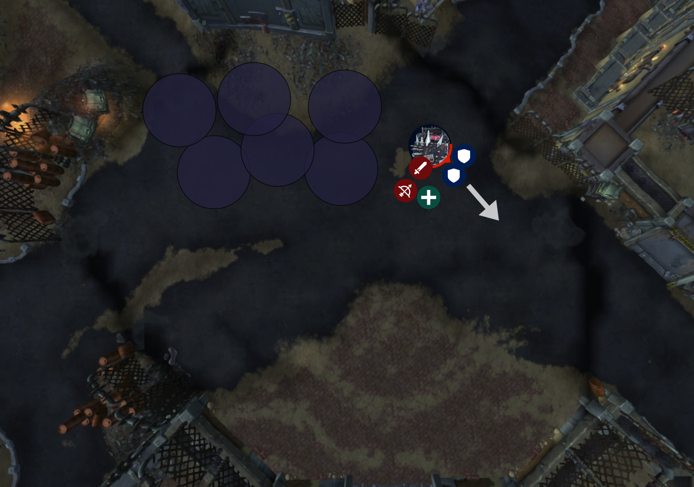
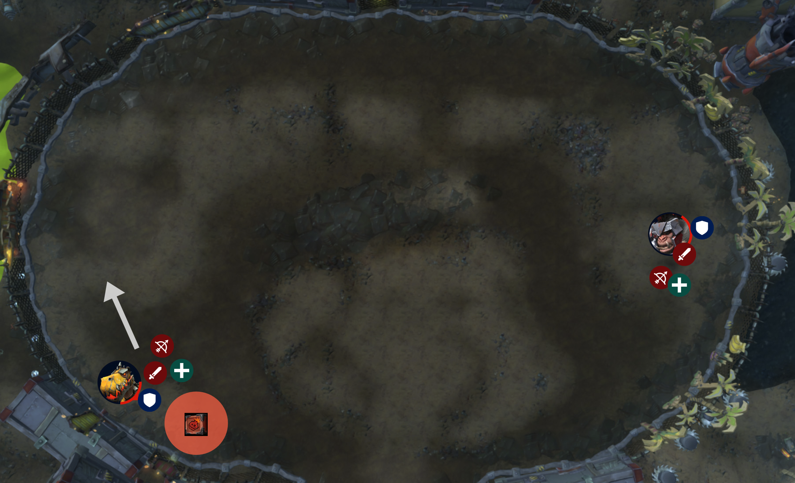
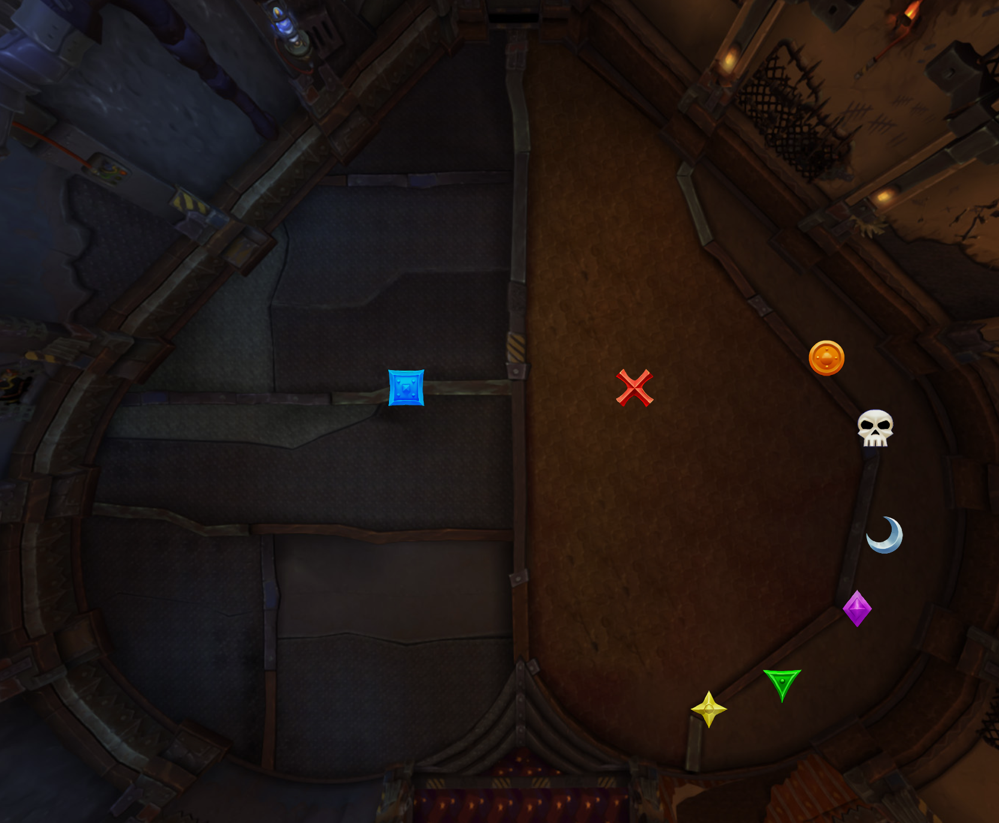

<link rel="stylesheet" href="style.css">

<main>

- [Vexie Fullthrottle and the The Geargrinders](#vexie-fullthrottle-and-the-the-geargrinders)
- [Cauldron of Carnage](#cauldron-of-carnage)
- [Rik Reverb](#rik-reverb)
- [Stix Bunkjunker](#stix-bunkjunker)
- [Sprocketmonger Lockenstock](#sprocketmonger-lockenstock)
- [One-Armed Bandit](#one-armed-bandit)
- [Mug'Zee](#mugzee)
- [Chrome King Gallywix](#chrome-king-gallywix)

# Vexie Fullthrottle and the The Geargrinders

## 📜 Overview

- **Two phases** that alternate
- **Mostly single target** with occasional cleave
- In **phase one** we fight the **boss** around the room
- In **phase two** the **boss** will shut down for a while and will take **double damage** and we AoE down a bunch of **adds**
- **Lust on phase two**

## 🛡️ Tanks

- You'll be walking the boss **around the room**
  - On normal difficulty there aren't actually any pools to force you along but we'll walk around for practice
- Your **tankbuster** is **physical damage** with a **phyiscal bleed DoT** and **knockback**
- There are **adds** but I don't think you need to pick them up
  - But test it out

## 🪖 Raid

### Phase 1

- If you get a **big purple circle** on you, move away from the raid and detonate somewhere by yourself
- If you get a **red arrow** on your head, the boss is going to throw **orange circles** at your feet and you need to **stutter step** around
  - Just don't run into other people or move around too much; try to keep those **orange circles** clustered
- Also in phase one, **a few biker adds** are going to spawn and launch themselves at us
  - Don't get hit by the **bikers** and then **kill them**
  - When the **bikers** are killed they will leave behind their bikes and I need volunteers to jump on those **bikes** and ride them into the **boss**
- For **positioning** let's all stay pretty close and grouped for healing unless you're dealing with something

### Phase 2

- The **boss** will **shut down** for a little while and take **double damage**, so lust it
- Also in phase two a **bunch of adds** will spawn and try to **repair** the boss
  - Kill these adds but also **interrupt** their casts and **stun** them
- Healer CDs in phase two

## ✅ Summary

- If you get a **big purple circle**, move away from the raid
- If you get targeted with a **red arrow** on you, stutter step around and don't run into other people
- Kill the **biker adds** and then **steal their bikes** and ride them into the **boss**
- For **phase two**, we lust it, and kill and interrupt and stun the **adds** that spawn but your **priority target** in phase 2 should still be the boss

## 💀 Heroic

- The **big purple circles** on players, Spew Oil, now leaves behind an **oil slick** which is a **big pool of bad**
- The **tankbuster** also leaves an **oil slick pool**
- Drop pools at the edge of the room and behind the boss and then we move along
- The **bikes** get **stunned** if they go over **oil slicks** so if you're helping out by driving bikes into the boss, **do not let your bike go through a pool**
- People dropping the **fire circles** can burn away the pools by making sure a **circle** hits the **pool**

# Cauldron of Carnage

## 📝 Preparation

- Prepare the raid to be split into two teams: **odds and evens**

## 📜 Overview

- Mostly **single target**
- For this fight we are going to be splitting up into **two teams**
- **Two bosses**; they don't share a **health pool**
  - We need the bosses to **die at the same time**
- The bosses **cannot be tanked together**
- **Odds** start on **TRex**, **evens** start on **Gorilla**
- The way this fight works is that we **stay with our team** and you fight your **boss**
  - Eventually the **bosses** will go into the centre for an **intermission**
  - During the **intermission** we stay close to our teams; follow your tank, and hit **both bosses** and dodge stuff
  - Once the **intermission** is over, you will be **switching bosses**; so the bosses will be taken back to their positions but your team will change to fight the other boss
- **Lust on pull**
  - _(Lusting during the intermission could also work because of cleave; but there is also lots to dodge which could act against it?)_

## 🛡️ Tanks

- Your job is just to **tank your boss** and have the boss be in a **good spot**
- There are **no adds** or anything else
- Can you watch your **boss' health pool**, especially when we're at **like 10%**, and coordinate your groups so that the bosses **die at the same time**
- Each boss has a **tankbuster** that you'll want a **defensive** for
- A couple of tips for your **tankbusters**
  - The **Dinosaur tankbuster** throws out **lava tornados** in all directions so make sure you are **alone** at all times; you don't want melee next to you
  - The **Ape tankbuster** is **physical damage** and any unmitigated damage is repeated as nature damage; so nothing special you just want to **mitigate as much as you can upfront**
    - _Spell reflect might work?_

## 🪖 Raid

- **Stay with your team** at all times
- When you're on the **TRex** side there are **two main things** to know about
  - Occasionally a **big bomb** will spawn; it is a **group soak** so please help soak
  - One person will get targeted by the **TRex** with a **laser beam**
    - The way this **laser beam** works is that first the boss will **aim** at you for a few seconds and then he'll **lock into position**
    - Once he's **locked**, then you can move out of the beam because he'll take **another second or two** to shoot
    - If you get the **laser beam** you should stay still and **minimise your movements** so other people can dodge
    - If we're doing the **soak mechanic** at the same time, just shuffle to one side of the **soak circle** and stay still until the **TRex** locks into place
- For the **Gorilla** side there are **two main things** to know about
  - One is called **Static Charge** in which you will be given a **bar** on your UI
    - The bar **fills up** if you **move**, and **empties** when you **stay still**
    - You don't want the bar to fill up or it will **stun** you
  - The **second ability** is that everyone on the **Ape side** will be targeted with **constant circles** that you want to dodge
    - That's going to force you to move but, again, you want to minimise your movements so move, stop, move, stop; that's called **stutter step**
    - **Try not to walk towards other people** because they are dealing with their own circles

## ✅ Summary

- Stay with your team; **odds** starting on **TRex**, **evens** starting on **Gorilla**
- When you're on the **TRex** side, help out with the **group soak** and if the boss targets you with a **laser beam** you need to **stay still** until he locks; then move
- When you're on the **Ape** side, minimise your movements
  - And when the **blue circles** appear underneath everyone, **stutter step** around
- When the bosses **fight in the middle**; that's the **intermission**; you **dodge stuff** and **hit both bosses** and then you **swap sides**

## 💀 Heroic

- The **soak** on the **TRex** side leaves behind a **pool**
  - We need to make sure we are baiting the bomb into a good spot and minimise running out of space
- The **TRex** throws out a **circle/DoT** on a bunch of people
  - Spread out and big heals
- On the **Ape** side, **adds** appear and **fixate** on people for **12 seconds**
  - The adds **mustn't touch anyone**
  - Use **snares**, **stuns**, **knockbacks**, **Evoker landslides**, **Entangling roots**, and **speed boosts**
  - They **expire** after **12 seconds** so no one touch them with damage

# Rik Reverb

## 📜 Overview

- Single target
- This fight has **two phases** that alternate
- In **phase one** we fight the **boss** while keeping some **pylons** low on energy
- In **phase two** we ignore the **boss** and we move together as a group to find **safe spots** in the room
- **Lust on pull**

## Phase 1

### 🪖 Raid

- The **boss** is going to spawn in a couple of **pylons** called **amplifiers**
  - The **amplifiers** will slowly fill up a **progress bar** and our objective is to make sure they don't fill up
  - To **discharge** an amplifier you **go up to it and right click on it**
  - This job is best done by **ranged**, including healers, and the **offtank**
  - Discharging an **amplifier** puts a **stacking debuff** on you to discourage like two people doing all of them; we need to rotate people in and out to do it
  - Eventually we **might have like six amplifiers** up at a time and we need a bunch of ranged volunteers to help with dicharging
  - Be aware that **discharging** hurts so maybe use a personal
    - And also, when you are discharging you can **still move and cast** so once you've started dishcarging you can get back to fighting or healing as long as you stay close to the pylon
- If you get a **blue circle** on you, spread out and stay away from others
  - Also you shouldn't help with **pylons** while you have the **blue circle** because it'll hurt too much
- The other ability is a **blue beam** that is targeted on one person
  - The boss will shoot a **laser** at you so if you get targeted for this **blue beam**, stay still and **let other people dodge you**

### 🛡️ Tanks

- **No tankbuster**, but the boss' **melee hits** are a **frontal** with a **stacking debuff** so you need to **face him away** and swap after about **four or five stacks**
- **Keep the boss away** from the **amplifiers** because he **empowers** them if he's close
  - But also not too far away because we need to be able to **discharge the amplifiers**
  - Somewhere around 20yd away would be good
- If you are not tanking the boss you can help **discharge the amplifiers**

## Phase 2

- Ignore the **boss**; stay together as a **group**
- The **boss** is going to be casting a **nova** which is **lethal** if it touches you
- In order to survive the **nova**, we need to run to one of the **amplifiers** that has a **big blue circle**
  - The **amplifier** with the **blue circle** is randomly chosen
- There's also **lots to dodge** during this phase
- And we also have to keep an eye on the other **amplifiers** and make sure **none are close to full**

## ✅ Summary

- Ranged, healers and tanks keep the **amplifiers** low on **charge** by clicking on them
- Spread out when we get **blue circles** on us
- If you get targeted for **Sound Cannon**, stay still and let other people move
- In **phase two** follow the team to the **big blue circles** for safety

## 💀 Heroic

- A bunch of **stationary adds** spawn that start casting a **big cast**
  - Can't let the **cast** go off
  - Just **kill the adds** quickly
  - The adds give you a **haste buff** when you attack them
  - Bring some AoE
- **Discharging an amplifier** now leaves behind a **stacking debuff**, discouraging the same people from doing it over and over
  - We should be already handling this by having **multiple volunteers** help with **amplifiers**

# Stix Bunkjunker

## 📜 Overview

- This boss has **one phase** and is mostly **single target** but has some **add AoE**
- The **main mechanic** of this fight is the **boss** is going to spawn **small piles of garbage** all over the place
  - When this happens, a few people are going to be turned into **Rollers**; basically a **ball rolling forward**
  - If you are a **roller**, your job is to collect **garbge** by rolling into it
  - You have a **progress bar** on your UI to fill up, and so once you are **full** you need to roll into a **big bomb**
  - There will be at least one **big bomb** in the room and if they go off it's a wipe so rolling into the **big bombs** is your priority
  - If there are no **big bombs** left because other people have dealt with them, then just roll into the **boss**
  - If you see any **adds** running around, feel free to **run over them**
- As far as I know a few people get randomly selected as rollers and I think it includes **one tank**
- **Lust on pull**

## 🛡️ Tanks

- When the **adds** come out I think the **Scrapmasters** can't be tanked; they just jump around, but you must collect the **Hyenas**
- His **tankbuster** is called **Demolish** which is a **100% damage taken debuff** which lasts 50 seconds
  - I assume you **swap** on that or swap if one of you becomes a **roller**; I'm not sure

## 🪖 Raid

- Everyone is going to get **orange circles** on them; you **spread out** for that
  - And when you have an **orange circle**, you must **not walk into any garbage** because it'll catch fire and **pulse AoE damage** on us
- A tip if you become a **roller** is that you'll notice that there are **two types of trash piles** to roll over; **small** trash piles and **larger** trash piles
  - You need to start out with **small piles** until your progress metre is **over half way**, then you can do the **larger** ones

## ✅ Summary

- If you are a **garbage roller**, collect garbage and then roll into a **big bomb** or the boss
- When the adds come out, interrupt **Scrapmasters** and AoE everything down
- When you get an **orange circle** on you, spread out and don't walk into any garbage piles

## 💀 Heroic

- There are these new **adds** called **Bombshells** that guard a garbage pile
  - Everyone needs to help **DPS them down**; at 75% HP, they get off their trash pile
  - Rollers must not roll into these guys ever; so that's a thing to **dodge**

# Sprocketmonger Lockenstock

## 📜 Overview

- **Two phases** that alternate
- **Single target**
- This fight is mostly about **dodging stuff** and working around the **environment**
  - A lot of the time sections of the platform will be unavailable due to electricity or other bad stuff
  - _(Point out the grates you can fall through near the small conveyor belts)_
- **Lust on pull**

## 🪖 Raid

- In the **first phase** we are fighting the boss and dodging mechanics
- We generally want to stay fairly **clustered together for healing**
- Occasionally the boss is going to **electrify** about **half the room** and we will need to **move accordingly**, so follow the tanks
- The **central conveyor belt** is usually fairly safe
- **The left and right conveyor belts**: you can use them if you need but they might occasionally have **hazards** on them
- If you get a **yellow arrow** on your head it means you'll be dropping a few small **pools**; so for that **stutter step** around in a small area to keep the pools contained; **you don't need to run away** to drop the pools
- Also in **phase one**, the boss will cast **Activate Inventions** which will do one of the three possible things; either you **dodge beams** that are going across the room left to right; or you **dodge rockets** that are firing all over the place; or you'll see these **magnets** on the **centre conveyor belt** and you want to not get sucked into the magnets
- In **phase two** we are going to be thrown by the **boss** to one side of the room and we need to make our way back to the boss while dodging everything

## 🛡️ Tanks

- The boss' **melee hits** are a **stacking debuff**, which is also a **snare**, so just be aware of your **low movement speed**
- And occasionally he'll strap a bunch of **fireworks** to you and you need to **run away from the raid** to explode; the damage is **falloff**
- Other than that in **phase one** you just need to position the boss well and move the boss when he casts **Wire Transfer** because Wire Transfer means he's electricifying part of the room
- There's nothing special you need to do in **phase two** because the boss is having some downtime; just get to the boss and attack him

## ✅ Summary

- **Yellow arrow** on your head means you'll be **dropping pools**; so stutter step to keep them clustered
- When the boss **activates inventions**, you'll either be dodging **beams**, or dodging **rockets**, or avoiding getting sucked into **magnets**
- In **phase two**, find a safe path to the boss by using the **conveyor belts**, use speed boosts and dodge everything

## 💀 Heroic

- The boss now spawns in **several land mines** around the platform
  - The **land mines** will eventually explode
  - When they explode, they **AoE us all** and put a **2sec debuff** on us, so if multiple go off at once it's a **wipe**
  - What we need to do is **stagger the explosions**
  - **One person** can't do them all because of a **debuff**
  - Create **a few land mine teams** made up of ranged/healers
    - Maybe each team can be **1 tank** and **2 ranged**, if the tanks are not too busy?
    - E.g. Team 1: Tank (any) --> Ism --> Salbei --> Let last one expire; Team 2: Tank (any) --> Fivemin --> Jordo --> Let last one expire

# One-Armed Bandit

## 📝 Preparation

- There are six possible combinations
  - Flame/Coin
  - Flame/Bomb
  - Coin/Bomb
  - Flame/Shock
  - Coin/Shock
  - Bomb/Shock
- We'll usually leave shock (pylons) to last?

## 📜 Overview

- **Two phases**
- Mostly **single target** with occasional adds; **good for multi-dotting** but not good for AoE
- **Phase two** begins at **30% health** (or after 6 token combinations) and it's a race to the end with a **hard enrage**
- **Lust in phase two**

## Phase one

- The way this fight works is that the boss is going to **spawn three adds**
  - The **three adds** need to be **interrupted** and **killed**
  - When the adds die, they leave behind a **token**
  - The token is one of **four possible symbols**: either **Flame**, **Shock**, **Coin** or **Bomb**
  - We can pick up the **tokens** and take them to the **boss**
  - Once we submit **two** of them, we are done and the boss will do a mechanic
  - **For example** if we kill the three adds; one of them might drop **Coin**, one of them **Flame** and one of them **Bomb**
    - We submit **any two we want**, such as **Flame** and **Bomb**, and we're done
  - The key is that we cannot submit a combination that we've **already done**; if we submit **Flame** and **Bomb** again later in the fight, we wipe
  - I'll try to call out which **combination** we're going for, otherwise **I am not too fussed** which order we do them in
  - I need anyone; **melee** or **ranged** to be the ones to volunteer to pick up a token and submit it
- **Phase one** has a lot of mechanics, so I'll only go over them quickly
- First of all, the boss will launch some **coins** out marked by **blue lines** on the ground
  - The **coins** are very big and they will **roll through the raid**; you need to **dodge them**, but standing next to them when they roll past you will give you a **damage/healing buff**
    - So it's up to you if you want to gamble your life for that
- If you get **fixated by an add**, don't let it touch you and kite it through the melee so everyone can kill it
- If you get a debuff called **Withering Flames**, a healer needs to **dispel** you
  - But when we do you'll unleash **flames** around you so we need you to **move away first** and then **ask for a dispel**
  - Healers don't dispel in this fight unless the person is **in a safe spot**

### 🛡️ Tanks

- Walk the **boss** around the edge of the room
- Your **tankbuster** drops a **pool** so you'll want to be against the wall for that
- I don't think you need to pick up the **adds**
- Another task for you is to help with the **coins** rolling through the room
  - When the **coins** roll through they will eventually hit the wall, they'll just **sit there forever** ticking damage on us
  - But if you walk up to them you can **roll them once** more to destroy them
  - It's up to you if you want to roll them **through the raid** or roll it **straight into a wall**
- One last thing to mention is **pylons** and **running out of room**
  - I don't know if this is a necessary strat, it might be more of a **heroic** thing
  - But if we're running out of room due to **puddles** on the floor, you can **activate pylons** to destroy pools
  - The **pylons** occasionally spawn due to the **token submission mechanic**
  - That's just an **FYI**; up to you if we need to do it

## Phase two

- No more **adds**
- Still the **coins** rolling through and still the tanks are **dropping pools**
- The boss is going to tether itself to some **pylons** with **lightning**; it's really obvious just **avoid lightning**
- The main thing to be aware of is red arrows on your head
  - If you get targeted with a red arrow you need to **self isolate** because the boss is going to shoot a **laser beam** at you and you don't want to hit anyone else
  - So red arrows to the wall

## ✅ Summary

- Dodge the **coins** that roll through the room; but stand next to them for a **buff** if you choose
- When the boss spawns **three adds**, kill them and submit **two** of their **tokens** to the boss
- If you are being **fixated** by an **add**, don't let it touch you
- If any **adds** put a **debuff** on you, move away and ask for a **dispel**
- In **phase two** if you get targeted with a **red arrow** on your head; move away from the raid

## 💀 Heroic

- The **bombs** that chase people leave a **DoT** if they make contact
  - No real change in strategy, it's just more punishing

# Mug'Zee

## 📝 Preparation

- Place a **blue marker** for the **blue/grey** side and a **red marker** for the **red/brown** side
- Organise two teams: **left team** and **right team**
  - Each team needs **four DPS** (melee or ranged is fine) and **one healer**
- Make it so that those teams are sorted in raid as well for easier healing
  - Maybe **group 2** can be **team left** and **group 3** can be **team right**
- Place **markers** as per image
  - This is for the **soaks**
  - **First round of soaks** will be **left team** on **green** and **right team** on **yellow**
  - Then left moon, right purple
  - Then left skull, right orange

## 📜 Overview

- **Mostly single target** with occasional adds; not very AoE friendly
- This fight has **two phases**
  - In **phase one** we will be fighting the boss on either the **blue side of the room** or the **red side**
  - The boss' **mechanics** are completely different based on which side of the room we're on
- And then **phase two** is a burn phase where **all mechanics are active**

## 🪖 Raid

- First up is **red side**
  - We're going to do **team assignments** for this side; so **group 2** and **group 3** you have a special role on **red side**
  - **Group 2** you are **team left** and **group 3** you are **team right**
  - What's going to happen is **two group soaks** at the same time
  - We're starting the fight over here near **yellow and green**, so I want **team left** on the **left marker**, which is **green**, and **team right** on the **right marker** which is **yellow**
  - So as soon as the **soak** mechanic happens, **team left** group up on **left marker**, **team right** group up on **right marker**
  - You can see there are more markers; again we do left and right, and then later, left and right
  - If you're not in special team for the **red side** then you can just stay out and **focus the boss**
  - Only a couple of other mechanics on red side
    - Occasionally you might get a **debuff** that will give you **slippery feet**; nothing you need to do it just makes it hard to move around
    - The other thing is a **lightning frontal** from the boss; everyone dodge it
- For the **blue side** we also have group assignments but it's just **odds and evens** - have a look at what group you're in
  - The reason we're doing groups is for a **group soak** which is a **big red swirly** on someone
  - When you get the **big red swirly** on you, take it to a wall and **odds team help soak**; **odds** up first and then later on **evens** will do the next soak, and we just rotate
- The next mechanic on **blue side** is **crawler mines**
  - These are adds that **fixate**
  - You **can't kill them** with damage; instead we need to **walk into them** to set them off but we **don't** want to do them all at the same time because it's too much damage
  - So we need to **stagger them** by about 2 or 3 seconds apart
  - So if I **call out your name**, walk into your own mine
  - If you're the **last one left with a mine**, just set yours off when you're ready as long as you're healthy because I'll probably ignore the last person
- The next mechanic on **blue side** is a **red line focussed on one person**
  - The line is the **tank mechanic** and what you need to do is **stand still**
  - Then the **tank** will save you, and then you'll get a **big red circle** on you, **move away** from the raid with the **big red circle**
- The only other thing on **blue side** is a **frontal** from the boss; dodge it
  - And **goblin adds** also come out, kill them quickly

## 🛡️ Tanks

- Start by taking the boss over near **yellow** and **green**
- Your job is to watch the **boss' energy meter** and make sure it **doesn't get to 100**
  - I would think that at about **80 energy** or so we should be moving to the **opposite side of the room**
  - We should be switching sides about every **60 seconds**
- On the **red side** your priority is the boss and his position
  - Don't let yourself or the boss go into the **soaks** (the gaols)
  - Your tankbuster is a knockback and then you'll start **dropping pools**
  - You need to **keep moving** to drop all of your **pools** otherwise you'll get **stunned for 30 seconds**
  - I recommend keeping the boss close to the **walls**, get knocked back into a wall and then run along walls or just anywhere away from the raid to keep the pools away from us
- On the **blue side** can you take us to one side of the room (either)
- We'll be dropping some **puddles** so we want to give us space
  - For blue side you need to **take a bullet for someone**; that's your tank mechanic
  - What will happen is that **one random person** will get targeted for a **laser mechanic** and you need to **stand in the path** so you take the hit
  - And of course **mitigate** as much as you can because the **damage** you mitigate **reduces** the **damage** that the person takes

## ✅ Summary

- **Red side**
  - We're dealing with the **gaols** which basically means **team left** starting on green, **team right** starting on yellow
  - The boss has a lightning frontal; everyone dodge it
- **Blue side**
  - Kill the **goblin adds** any time they spawn
  - When the **crawler mines** come out, you can't kill them with **damage**; instead we need to **boop them** one at a time and **stagger their explosions**
  - For the **big group soak**, take it to a **wall** and everyone help soak if you're able
  - The boss will do a frontal **cone of bullets**; everyone dodge it
  - If the boss targets you with a **line on the ground**, stay still and **let a tank save you**; once the tank has saved you, **run out with your big red circle**
- For the **intermission** the boss is going to **charge** at someone and then he'll spin around shooting out of his sides
  - So you need to follow the boss when he charges so you're close and then dodge his AoE
- **Phase two** is is **red and blue side** at the same time

## 💀 Heroic

- **Red side**
  - The **boots** mechanic that makes people **slippery** will now shoot a **spear** at those people
  - You do not want to get hit by the **spear**
  - **Line of sight** using the **gaols** so that the spear hits the **gaol walls**
- **Blue side**
  - Players can't soak every rocket because of a **debuff**
    - We are already handling this with **two groups**
  - People who detonate a **mine** cannot do it again due to a debuff
  - Detonating the **mines** causes a bunch of individual soaks

# Chrome King Gallywix

## 📝 Preparation

- Img
- Description

## 📜 Overview

- Phases...

## Phase one

- Description

### 🛡️ Tanks

- Description

### 🪖 Raid

- Description

## Intermission

- Description

## Phase two

- Description

### 🛡️ Tanks

- Description

### 🪖 Raid

- Description

## Phase three

- Description

### 🛡️ Tanks

- Description

## ✅ Summary

- Description

## 💀 Heroic

- Description

</main>
