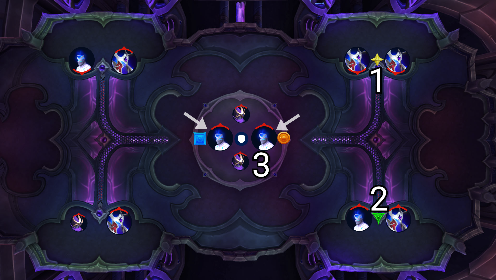

<link rel="stylesheet" href="style.css">

<main>

- [Plexus Sentinel](#plexus-sentinel)
- [Loom'ithar](#loomithar)
- [Soulbinder Naazindhri](#soulbinder-naazindhri)
- [Forgeweaver Araz](#forgeweaver-araz)
- [The Soul Hunters](#the-soul-hunters)
- [Fractillus](#fractillus)
- [Nexus-King Salhadaar](#nexus-king-salhadaar)
- [Dimensius, the All-Devouring](#dimensius-the-all-devouring)

# Plexus Sentinel

## 📜 Overview

- Description

## 🛡️ Tanks

- Description

## 🪖 Raid

### Phase 1

- Description

### Phase 2

- Description

## ✅ Summary

- Description

## 💀 Heroic

- The **group soak mechanic** fires **twice** and **knocks people back**
  - Let's have the **soak person go to melee**; first shot **melee soak**, then for the second shot all **ranged** run in
  - The knockback knocks you far up and back enough that **you don't have time to help with both** unless you have blink or leap
- There are some **extra swirlies** to dodge but I don't think it changes our strategy

# Loom'ithar

## 📜 Overview

- Description

## 🛡️ Tanks

- Description

## 🪖 Raid

### Phase 1

- Description

### Phase 2

- Description

## ✅ Summary

- Description

## 💀 Heroic

- The **orbs** that encircle us have a **barrier** on them and so we cannot attack
  - The **tanks** have to use **their frontal/line mechanic** to choose an **orb** to break its **barrier**; allowing us to attack
- If you're standing in a **pool of bad** when you snap your **tether**, you get stunned (no change in strategy - just don't do that)
- In **phase two**, the **split damage frontal** applies a **debuff** which means you cannot do two in a row, but we already handle that with groups

# Soulbinder Naazindhri

## 📜 Overview

- Description

## 🛡️ Tanks

- Description

## 🪖 Raid

### Phase 1

- Description

### Phase 2

- Description

## ✅ Summary

- Description

## 💀 Heroic

- There should be a total of **12 chambers/adds** instead of 6
  - It means that after we deal with 6 of the adds, the remaining 6 will come out at once and it'll be a clusterfuck
  - Tanks need to pick up the adds and ask for misdirects/tricks, ranged need to interrupt any mages

# Forgeweaver Araz

## 📜 Overview

- Description

## 🛡️ Tanks

- Description

## 🪖 Raid

### Phase 1

- Description

### Phase 2

- Description

## ✅ Summary

- Description

## 💀 Heroic

- The **soak mechanic** leaves behind a **debuff**, meaning you can't soak twice in a row
  - We already deal with this by using **groups**

# The Soul Hunters

## 📜 Overview

- Description

## 🛡️ Tanks

- Description

## 🪖 Raid

### Phase 1

- Description

### Phase 2

- Description

## ✅ Summary

- Description

## 💀 Heroic

- Description

# Fractillus

## 📜 Overview

- Description

## 🛡️ Tanks

- Description

## 🪖 Raid

### Phase 1

- Description

### Phase 2

- Description

## ✅ Summary

- Description

## 💀 Heroic

- Description

# Nexus-King Salhadaar

## 📜 Overview

- Description

## 🛡️ Tanks

- Description

## 🪖 Raid

### Phase 1

- Description

### Phase 2

- Description

## ✅ Summary

- Description

## 💀 Heroic

- Description

# Dimensius, the All-Devouring

## 📜 Overview

- Description

## 🛡️ Tanks

- Description

## 🪖 Raid

### Phase 1

- Description

### Phase 2

- Description

## ✅ Summary

- Description

## 💀 Heroic

- Description

