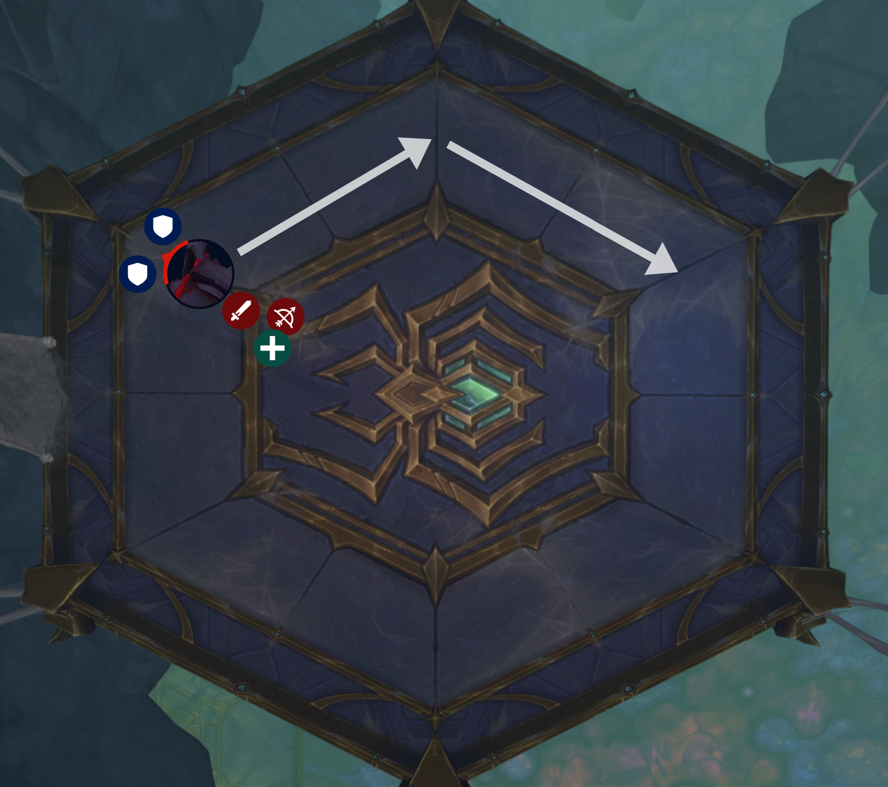
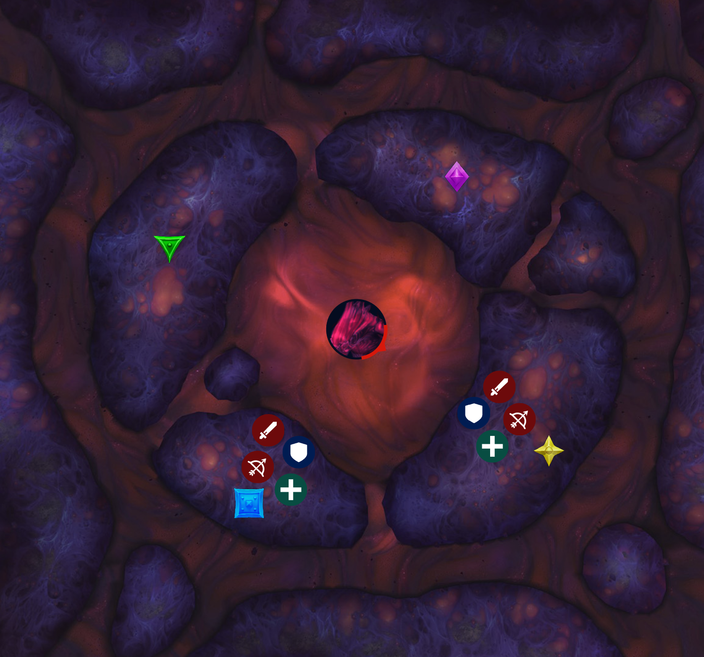
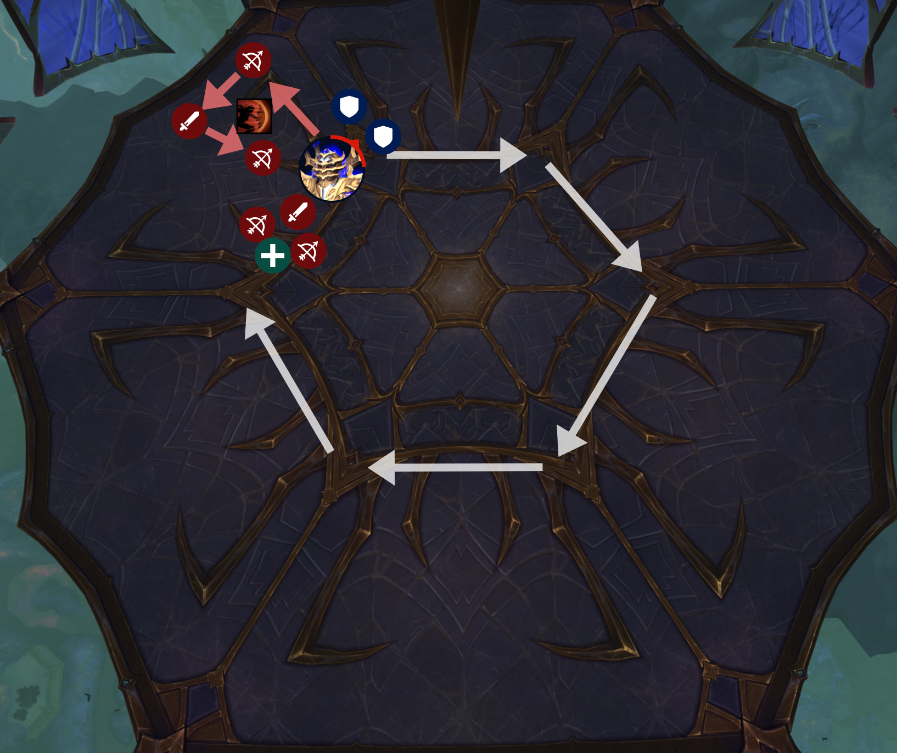
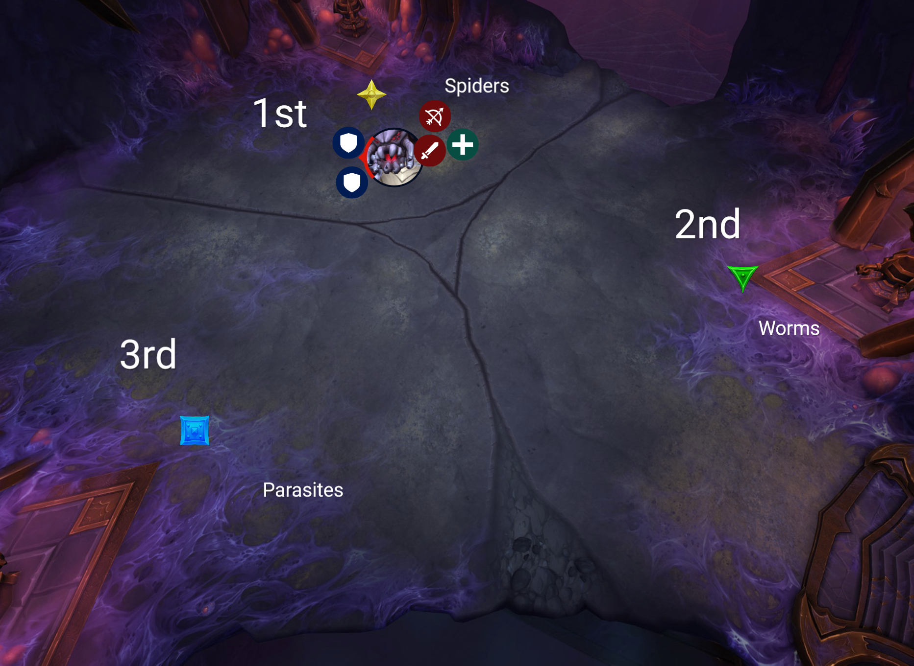
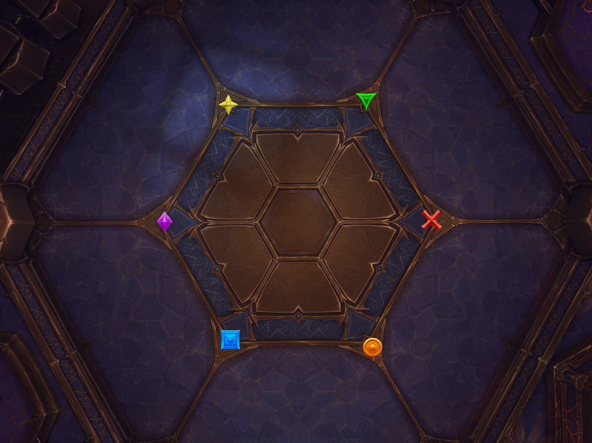
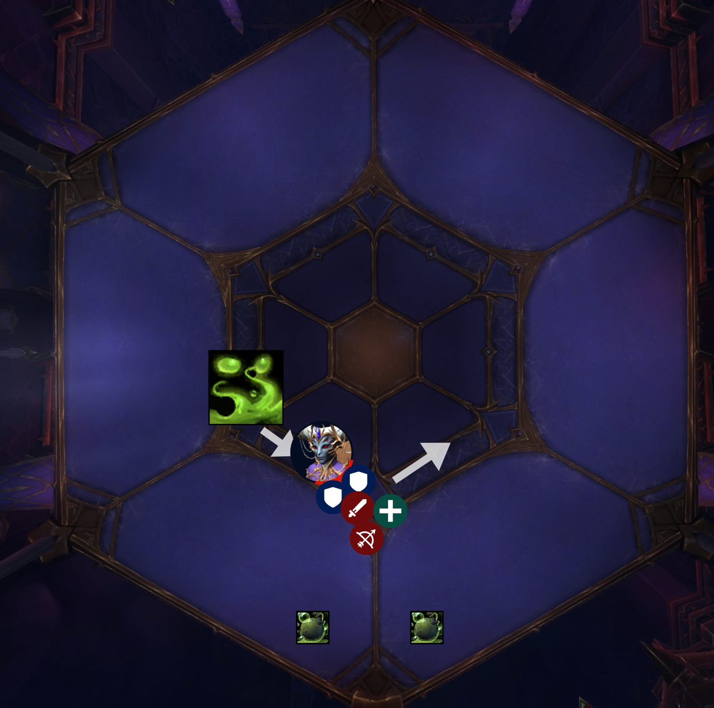

<link rel="stylesheet" href="style.css">

<main>

- [Ulgrax the Devourer](#ulgrax-the-devourer)
- [The Bloodbound Horror](#the-bloodbound-horror)
- [Sikran, Captain of the Sureki](#sikran-captain-of-the-sureki)
- [Rasha'nan](#rashanan)
- [Broodtwister Ovi'nax](#broodtwister-ovinax)
- [Nexus-Princess Ky'veza](#nexus-princess-kyveza)
- [The Silken Court](#the-silken-court)
- [Queen Ansurek](#queen-ansurek)

# Ulgrax the Devourer

## 📝 Preparation

## 📜 Overview

- This fight is mostly **single target** with occasional add cleave
- This fight has **two phases** and they alternate repeatedly
- In phase 1 we fight the boss
- In phase 2 the boss goes away and we kill adds and dodge deep breaths
- Heads up that you will be using extra action button

## 🛡️ Tanks

- For phase 1, tank the boss around the room as needed
  - We'll occasionally run out of space due to pools
- The **tankbuster** is a **frontal**, so face him away and don't both get hit
  - The **tankbuster** is a **mortal strike debuff** so we can't heal you until it wears off
- In phase 2 there is no boss, so you both help tank all the **adds**

## 🪖 Raid

### Phase 1

- In phase one there are going to be **webs** on the ground
  - The webs **root** you in place and hurt so you want to avoid them
- If you get targeted with a **green circle**, stand near some **webs** and you'll destroy them when you detonate
- There is a **group soak mechanic**
  - **One person** will get targeted for the **soak**, so everyone help save them
  - After the **soak** goes off, the boss is immediately going to **grip us in** to try to eat us
  - **Running away** from the boss is one option
  - But, if you are the one targeted for the soak, it's a good idea to **stand behind a web** because as we are pulled in, we'll get rooted by the web, which saves us
  - If you're going to **immune** your soak, call it out and make it obvious

### Phase 2

- The boss will go away and ocasionally he will appear one one side of the room and **charge** right through to the other side
  - It's basically a **deep breath**
  - Everyone needs to be constantly watching where the boss is in phase 2 and dodge the boss
- Other than that kill **adds**
- When the boss is done charging through a few times there is a bit of an **intermission**
  - The boss will return but he'll just be sitting there **pulsing AoE**
  - What we need to do is pick up the **corpses of the adds** that we killed and **feed them to the boss**
  - So go pick up a **dead add**, take it to the boss, and you hit your **extra action button**

## ✅ Summary

- If you get the soak mechanic, stand behind a web and everyone else help soak to save them and don't get pulled in to the boss
- If you get a green circle, use it to destroy webs
- In phase 2 dodge the boss charging through; kill adds and then feed the dead adds to the boss
- Lust at the start

## 💀 Heroic

- No changes known

# The Bloodbound Horror

## 📝 Preparation

- Split the raid into two groups

## 📜 Overview

- First thing: be aware that the **liquid** around the boss is **toxic blood** which hurts (test it)
- Also: snares, stuns, AoE snares, AoE stuns, knockbacks and Monk donuts are good things to have for this fight
- Odds left on **blue marker**, evens right on **yellow marker**
- This fight is **single phase** and is some **single-target** and some **multi-add cleaving**
- The way this fight works is that we will be **splitting up into two teams**
  - The boss is always in the **middle** and doesn't disappear or have an intermission or anything like that
  - But what will happen is that some **adds** will spawn and they can't be attacked because they are in the **upside down**; like, another realm
  - And so we need one team to **go under** and kill the adds

## 🛡️ Tanks

- **Immobile boss**, so always have a tank at the boss or it will AoE us; the exception is the **run away mechanic**
- We start on two platforms, but there are four platforms total, and **some adds** are going to spawn and they could spawn on any platform
- For the first round of adds I need you to call out **which team** will go under first to do **adds**; basically which ever of you feels closest to more adds
  - After the first round we just **alternate teams going under**; because of a debuff we can't have a team go under twice in a row
- There isn't a **tank buster** as such but instead the **tank mechanic** is a **massive frontal** and anyone that gets hit **goes under**
- So the adds will start to spawn, one of you take your team to the adds, taunt, and you make your team gets hit, and the other tank can taunt back
- When you're under, there are **three types of adds**
  - Only **one of the adds**, called a **Watcher**, needs to be **tanked** and can be moved; and it needs to be **interrupted** (_or it will cast a **shield** on the boss_)
  - This add **doesn't have a frontal**, so take it to other adds for **cleave**
  - The other type of **big add** is **stationary** and doesn't need to be tanked or **moved**; it will just sit there and spawn **little adds**
  - The **little adds** simply march towards the boss and if they reach him, they **detonate**
  - So your main job is the **Watcher add**, and other than that help snare, stun or grip the **little adds**

## 🪖 Raid

- **Follow your tank** and generally stay with your team
- If the **boss** is casting a **big blue frontal** on you, don't get out of it because your team is **going under**
- If you are **above** in the **normal realm**, your job is to attack the **boss**
  - If you get a **red arrow** on your head, you're going to **drop little pools** so stutter step around
- If your team goes **under**, your priority is **adds**
  - Interrupt the **big add** that is being tanked, kill anything else and also **snare and stun the little adds** so they don't reach the boss
  - Be aware that an add might spawn far away from you and its up to your team to get to them quickly
- The other big mechanic that everyone needs to be aware of is a **run away mechanic**
  - The boss will start a long cast and will have a **big blue circle** around it; just run away and group up for heals

## ✅ Summary

- Stay with your **team** and let yourself get hit by the **boss' frontal**
- If you get a **red arrow** on your head, stutter step around
- When you go under, kill adds, use **snares and stuns** on the **little adds**; don't let the little adds reach the boss
- **Run away** when the boss has a **big blue circle** around it
- Lust at the start

## 💀 Heroic

- The boss shoots out two laser beams that slowly rotate around
  - This will force us to move at a certain pace
  - Pro tip: the two lasers will always spawn on the boss' left and right
  - That means that the tank that has the boss can dictate where the laser beams start
  - The lasers rotate around the boss counter-clockwise

# Sikran, Captain of the Sureki

## 📝 Preparation

## 📜 Overview

- Single-target, single-phase
- This fight has **very few mechanics**
  - The main idea behind this fight is similar to **Terros** from Vault of the Incarnates, or E.D.N.A from Stonevault, where we **set up pillars** and then **knock them over** using the boss' ability

## 🛡️ Tanks

- The **tankbuster** is a two-one punch; he'll cast **Expose** twice in a row to debuff you _(with physical damage taken increase)_ and then **Lunge** as the finisher
  - So one of you take both **Exposes** and the other taunt for the **Lunge**
  - No frontal or cleave
- Other than that, just walk the boss **around the platform** as needed
  - We will be **dropping pools** so we'll be running out of space and so you'll need to move us along
  - I would recommend moving us along straight after we **drop clones**

## 🪖 Raid

- Group up behind the boss
- The first mechanic is that a few people will get targeted with **red arrows**
  - What will happen is that boss is going to **charge** at you and you'll leave behind a **clone**
  - This is a classic dash ability where the boss will dash at the first person, then dash to the next, and then dash to the next
  - To deal with this, everyone red arrow people go to the edge of the room and cluster up
- The next ability is that some people will get targeted with **blue arrows**
  - **Blue arrow** means the boss is going to shoot a **laser beam** at you and the beam **destroys clones**, which is a good thing
  - So if you get **blue arrow**, try to position yourself to knock down **clones**
  - When a **clone** is destroyed it leaves behind a **pool**

## ✅ Summary

- **Red arrow** on your head means cluster up at the edge of the platform because you're about to drop a clone
- **Blue arrow** means you're about to get lasered; so use the laser to knock down the clones
- Lust at the start

## 💀 Heroic

- On normal, only the marked players will drop a clone; but on heroic, anyone hit while he's dashing will also drop a clone
  - People need to make sure they are away from the marked people and don't get hit
- The pools are now permanent, though that shouldn't alter our strategy; it just means there is a soft enrage on floor space

# Rasha'nan

## 📜 Overview

- Mostly single-target with occasional add cleave
- If you did **The Dawnbreaker** dungeon then you've already fought this boss
- The way this fight works is that she is **stationary**, and we fight her, and eventually **she flies somewhere else** and we chase her
  - **Group mobility buffs** are good here
  - **AoE stuns and snares** are also good here

## 🛡️ Tanks

- **Stationary boss**; so always a tank within range
- The **tankbuster** hurts and comes with a **DoT** and the DoT hurts more the more damage that you took upfront
  - So, basically try to mitigate the **upfront damage**
  - Probably swap after each one

## 🪖 Raid

- If you get a **white circle** around you, move away and you'll **drop a pool**
  - You will be **tethered** to your pool so you need to walk out to **snap the tether**
- A few people will get **green circles**
  - If you get a **green circle** on you, cluster up near other **green circles** and you will spawn some adds
  - Everyone **stun and snare and kill** the **adds**
- Rasha'nan also has the **Rolling Acid** ability from the dungeon
  - This means that **two people** will get **green lines**; one person get out to the **left**, one person get out to the **right**
  - The ability **telegraphs** which directly the **acid** will travel
- One the boss is at **full energy**, she'll fly away and start casting something bad so we all chase the boss and she needs to be **interrupted**

## ⚕ Healers

- When people break their **tethers** it will **AoE** us all
  - But for now our strategy is to **heal through it** so lets use **healer CDs** when the white circles go out

## ✅ Summary

- Green lines get out; one left and one right
- White circles get out and snap your tather
- Green circles cluster up, then kill adds
- Chase the boss and interrupt
- Lust at the start

## 💀 Heroic

- The boss will cast a group soak; classic split damage
  - Everyone stack up
  - When we get hit she'll also grip us, attempting to throw us off the ledge
  - The strength of the grip is inversly proportional to the number of people hit
    - Meaning that if one person tries to immune it, just be aware that you'll possibly be flung of the ledge
- The white circles mechanic is more punishing of mistakes
  - If people without white circles get hit, they are also tethered
  - And since breaking tathers hurts, this could get out of control quickly
  - Just don't get hit by white circles
- Players now deal damage around them when they spawn adds, so they should spread out and other players must avoid them

# Broodtwister Ovi'nax

## 📝 Preparation

_This is just a guess. I think you can do these in any order._

_Each section has more of one kind of add. But we don't really know the best route._

## 📜 Overview

- This fight has some **add cleave** and **AoE**
- This room is divided up into **three sections**; blue, yellow and green
  - The way this fight works is that the boss will **activate one section** and that section will slowly fill up with **black blood**
  - The **black blood** is just a **pool** on the ground that expands
  - Our objective is to break the **eggs** before the **black blood** gets to them
  - We don't want to be in the **black blood** and we don't want any **adds** to be in the **black blood**

## 🛡️ Tanks

- Start us on **star marker**
- The boss will always activate the **nearest available section**
  - After **star section** is filled up we'll move on to another section; just pick one
- Her tankbuster is **nature damage**; not physical
  - It puts a DoT on you and when the DoT expires, it **nukes** you based on your **missing health**
  - So use a defensive and make sure you're topped up
- You'll also be tanking the **large spiders** that come out of the big eggs
  - The **big spiders** also have a nature damage tank buster and their damage ramps up over time
  - Keep the **big spiders** out of the **black blood**
- So the **boss** and the **big spiders** is your job; anything else is not really your concern

## 🪖 Raid

- **Adds** are always going to be the priority if there are any alive
- If you get a **blue circle** on you, you should stand near an **egg** to break it
  - That will spawn an add
  - Try to target **eggs** that are close to the **black blood**; you need to break eggs before the blood does
- Breaking **eggs** will spawn **adds**; there are three types of adds
  - The **big spiders** will be tanked and you just kill them
  - The **small spiders** will spawn in groups; they fixate randomly and if they touch you they will duplicate
    - So don't let the **small spiders** gets to you; use stuns and snares
  - The third type of add is **worms**
    - Worms are **stationary casters** so they need **interrupts**

## ✅ Summary

- Kill adds
- Don't let the little spiders touch you; use stuns and snares and knockbacks
- Interrupt the worms
- If you have a blue circle on you, stand next to an egg to break it
- Lust at the start

## 💀 Heroic

- The boss will put a white circle on people which is a DoT
  - It's a dispel mechanic
  - When removed, it damages and roots anyone in the circle
  - Therefore, people with white circles need to get out and then call for a dispel
  - Don't have a trigger-happy dispel finger

# Nexus-Princess Ky'veza

## 📝 Preparation

## 📜 Overview

- Single-target, repeating two phases
- _(There is a hard enrage if we don't meet DPS requirements)_

## 🛡️ Tanks

- You have a **tankbuster** with a **DoT** and **increased damage taken debuff** so you'll probably want to swap after a few stacks
- Other than that your main job is **good positioning of the boss**
- What's going to happen is that the **raid** is going to be **dropping a few phantoms** roughly on the markers
  - The **phantoms** are these stationary voidy images
  - Eventually the **phantoms** will turn into **portals** and these portals suck us in
  - If all of the **portals** are clustered up then that suction power will be **amplified**; its additive
  - One **portal** always spawns on the **boss**; so therefore what you want to do is position the **boss** so that she drops a **portal** that will suck the raid in the **opposite direction** to the other **portals** so that the suction is **cancelled out**

## 🪖 Raid

- If you get a **purple circle** on you, go to a marker and you'll drop a **phantom**
- Occasionally the **phantoms** will **point a line** at people and **dash** across the room
  - If you get targeted by this you should see a **red line** on the gorund indicting that the **phantom** is **dashing** at you
  - What you want to do is to try to keep the **phantoms** around the **markers** and also not have them **dash** through the raid and hit people
- In **phase 2** the boss will go into the centre of the room; keep attacking her
  - The only real mechanic is the **lines mechanic from Fyrakk** so spread out a bit and minimise your movements

## ⚕ Healers

- Hymn is not a good choice in phase 2 - too much movement

## ✅ Summary

- If you get a purple circle, go to a marker and you'll drop a phantom
- If one of the phantoms targets you with a red line, go to a marker and try not to hit people
- When the portals are doing a suction, position yourself so you don't get pulled in to a portal
- Lust at the start

## 💀 Heroic

- Anyone dealing with the dropping pools (Assassination) or laser beams (Twilight Massacre) shoot out orbs (3)
  - People need to dodge
  - More specifically it is a DoT (9 seconds), and you shoot out orbs when it expires
  - People dropping pools (Assassination) or laser beams (Twilight Massacre) need to stay away from others when their DoT is expiring
- In phase 2, there are now pizza slices of the room to dodge

# The Silken Court

## 📝 Preparation

- Pick **four people** (preferrably ranged) to be the web team; go to a separate Discord channel for explanations
  - Maybe put two markers: **yellow star** and **green triangle** on two of them as captains
- You have a special job in **phase one**; you need to stop the boss' charge
- **Anub'arash** is going to do a **charge** through the room
  - He will start on one side of the room and he'll **charge** through the raid and hit the wall on the other side of the room, and we need to stop him from doing this
- Throughout the arena there are going to be **pools** of **webs** on the ground
  - At the centre of these pools is a **big knot of webs**
  - If you touch the **knot** in the centre of the pool, it will go away but you will be **tethered** to another person in the same pool
  - _(The **tether** is like rainbow generator)_
- What I want you to do is that, when the **boss** is about to **charge through the room**:
  - You and your partner walk into the same pool of **web**, one of you touches the centre which will **tether** you together
  - Then, you spread apart in the middle of the room so that the **boss charges** through and hits your **tether**
- Couple of extra tips is:
  - Once you're tethered, don't split up more than about 25yd because you'll snap it
  - Also, on normal difficulty only one team is needed for this but it's good if we practice for heroic and have redundancy
  - But if the one team already succeeds in stopping the boss and you're still tethered then you can just snap your tether
  - This strategy is mainly for phase one
  - The charge also happens in phase three but the way we obtain webs is more random and so we'll deal with it a little differently
  - So walking into a pool of web is only in phase 1

## 📜 Overview

- **Two bosses**; they **share health**
- This fight is going to be pretty constant **cleave** and **occasional adds**
- There are **three phases** and **two intermissions**
  - The phases are all fairly similar; we're always fighting the two bosses, just the abilities switch up a bit
- In **phase one** we're trying to stop the boss from charging through the room which is lethal
- In **phase two** we've got a dispel mechanic to deal with, otherwise it's lethal
- In **phase three** we're dealing with everything
- The intermissions are both similar to each other: basically **dodge bad things and attack one target to get through a shield in time**

## 🛡️ Tanks

- You need to tank **both bosses**
- The **big bug** can be moved and has a **physical damage tankbuster**
- The **caster boss** is stationary and will spam bolts at whoever is tanking her
  - She'll also **teleport** around the room
- You'll want to keep the bosses together for **cleave** as much as you can

## 🪖 Raid

### Phase 1

- There are going to be **pools of web** on the ground, you can avoid these
- **Adds** are occasionally going to spawn and **fixate** randomly
  - Don't let the adds touch you; snare them and stun them and kill them
- If you get a **green circle** on you it means spread out
- The boss is going to **charge** through the room and we have a **web team** that will take care of this
  - So just avoid the **charge** and let the web team take care of it in phase one

### Phase 2

- There is a **dispel mechanic**; so **healers** don't be trigger-happy
  - What happens is that a few people will get a **debuff** called **Stinging Swarm**
  - If you get this **debuff**, you need to go stand right next to **Takazj** and then ask for a dispel using your character's name
    - The reason for this is that the **debuff** is **contagious** and will jump to the nearest target and we want to put it on the **caster boss** and not each other
- The boss will cast a **vortex** that is going to **grip** everyone in
  - When you get gripped in, **run away** from the boss and you're also going to be **tethered** to someone, and you can snap that tether by moving away from them

### Phase 3

- We still have the **vortex grip** ability, but this time I need **ranged** to **not break your tether**
  - The reason for this is that the boss' **charge** is back, and we need **tethers** to stop that
  - So if you are ranged and you get tethered in **phase 3**, don't break your **tether** and instead try to stop the boss' charge
  - The way you stop the boss is that the **charge** will be telegraphed like a road or path across the room, and you and your tether partner need to stand on either side of the road
  - So any ranged that can help stop the **charge** in phase 3 should try to so
- We are still dealing with the **dispel mechanic** in phase 3

## ✅ Summary

- In **phase one**
  - Kill **adds**
  - Spread out for **green circles**
  - Web teams prevent the boss from **charging**
- In **phase two**
  - If you get the Stinging **Swarm debuff**, go to **Takazj** and ask for a **dispel**
  - Run away when we get sucked in to the boss and snap your **tethers**
- In **phase three**
  - Run away when we get sucked in to the boss but ranged keep your **tethers**
  - Ranged DPS need to use the **tethers** to stop the boss' **charge**
- **Lust** in phase 3

## 💀 Heroic

- Anub'arash needs to charge through two webs rather than one

# Queen Ansurek

## 📝 Preparation

- Split the raid into two groups: **red team** and **blue team**
  - **Odds** blue, **evens** red
- Figure out which team is going to go to which platforms, and place **blue** and **red** markers accordingly
  - (Are there north and south platforms or east and west?)

## 📜 Overview

- **Three phases** with an **intermission** after **phase one**
- In **phase one** we attack the boss and occasionally have to detonate bombs in order for us to jump over her poison nova
- For the **intermission** we have to burn through her shield
- In **phase two** we are splitting up into two teams, dealing with adds and hopping across platforms
- In **phase three** we are dealing with portals where we need to teleport in order to escape a ring closing in on us

## Phase one

### 🛡️ Tanks

- Tank the boss around the outer bronze web
- Your **tankbusters** are **Liquefy** and **Feast**
- Swap on **Liquefy**; it drops a pool so you'll need to move the raid along
- **Feast** is pure physical damage and leaves behind a heal absorb, so ask for extra healing or an external

### 🪖 Raid

- **Teams** are relelevant so make sure you know what team you're in
- We're clustering up for an ability called **Silken Tomb**, it's going to **root** us all in place and we have to break out with AoE
- **Two people** will get targeted to drop a **pool**, called **Reactive Toxin**
  - In the centre of the pool you leave behind is a **bomb** and if anyone touches that bomb it detonates
  - What I want you to do is drop those two **pools** towards the **edge** of the platform and **a bit apart**
    - Then you can come back to the raid
- The boss is going to cast a **poison nova**; basically a big **ring** that emantes outwards across the platform and we need to dodge it
  - The way we dodge it is the bomb at the centre of each pool, because the bombs flings you up into the air
- So therefore, what we need to do, is that when the **nova** is coming up, **blue team** stand in the **left pool** and **red team** stand in the **right pool**
  - Before the **nova** reaches everyone, **one volunteer** per group touch the **bomb** which will launch us into the air
  - Each time we do this I need a new volunteer; you can't activate the **bomb** more than once

## Intermission

- The boss has a **shield** and we need to burn through it
- Occasionally she will do a **grip** and pull us all in and so we need to run away for that

## Phase two

- There will be two big adds called **Worshippers** that have a **two minute cast**
  - At the end of the **cast**, we **wipe**; so our goal is to get to them first
- We are going to **split up** into our teams, blue and red, and hop across platforms killing adds
- In order to get across platforms we need to use the **Voidspeakers**
  - Each team gets a **Voidspeaker** and they **share health**
  - When you kill a Voidspeaker, they **detonate**, knocking everyone back
  - So make sure you are positioned so you get knocked to the next platform

### 🛡️ Tanks

- I assume you tank everything you can, except maybe **Expellers** which are casters
  - Pick up adds like **Chamber Guardians** and **spiders** and the Voidspeaker
- When your **Voidspeaker** is about to die, make sure your team is positioned for the knockback to cross the platform

### 🪖 Raid

- The **Expeller** adds shoot **beams** at people which do a **knockback**
  - Make sure you don't get knocked off a ledge and make sure your beam doesn't knock other people off the ledge

## Phase three

- Two people will get a debuff called **Abyssal Infusion** which will drop a portal each
  - I want you to drop these portals apart; one close to the boss a bit behind the raid, and one further away
- What's going to happen is that the boss is going to cast a **reverse nova**
  - As in it's a **ring** that starts big and contracts towards us and we don't want to touch it
- Therefore, as the ring passes between the two **portals**, we enter the closest **portal** so that we teleport to safety

### 🛡️ Tanks

- The **Infest** tankbuster is a taunt swap and means you need to **run away** from the raid because you're about to detonate and the damage is falloff
  - And then you'll also spawn spiders, so yell out for people to kill them
- **Gorge** is another tankbuster which causes swirlies and pools and we might need to move

## ✅ Summary

- In phase one, drop the two **pools** near each other, but a bit apart, at the **edge of the room**
  - When **Venom Nova** comes up, we stand in the pools with our teams; **blue team** left pool, **red team** right pool
  - One person per team **detonates** the **bomb** before the **nova** reaches us
  - Also in phase one, cluster up close for **Silken Tomb** and then help everyone break out of the roots
- For the **intermission** burn through her shield and don't get too close to her when she grips
- For **phase two**, stay with your team
  - Interrupts on the **Voidspeakers**
    - When the **Voidspeakers** die, use their explosion to knock you to the next platform
- For phase three we are dropping **portals**
  - When she casts her **collapsing circle** ability, we go through the **portal** to survive

## 💀 Heroic

- Phase one
  - It's important to have a fairly even number of people in each Frothy Toxin soak
    - This is because a stacking DoT is applied which is reduced by having more people in
    - We already do this in normal so there should be no change
  - Killing the roots leaves behind web
    - We'll need to move around the room after each Silken Tomb
  - Feast heal absorb shield is proportional to the initial hit, so tank defensive before the hit is critical
- Intermission
  - The DoT that everyone has now has a little circle; so spreading out slightly is needed
- Phase two
  - The Voidspeaker adds have orbs around them that people need to dodge
  - Dispelling the Gloom Touch explodes, doing damage to the raid
    - We might need to stagger the dispels? Or is it a distance thing?
- Phase three
  - When the Acolytes die, they leave behind an essence that can be picked up
    - A volunteer needs to pick it up and take it through the portal with everyone else so that the collapsing ring doesn't hit it
    - A player cannot pick up more than one essence because it gives them a 4 minute debuff
    - The essence destroys the portals, (leaving behind a pool?), not sure if this changes the strategy; maybe the volunteer goes in last?
  - The Royal Condemnation falloff mechanic shackles players?

</main>

